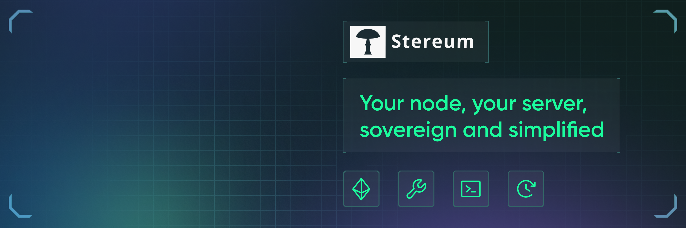

 

# Welcome to the Documentation and thank you for choosing Stereum 

We're thrilled to have you onboard and are confident that Stereum will enhance your experience with Ethereum. This documentation is designed to provide you with all the necessary information to successfully utilize Stereum for managing Ethereum nodes.

Whether you're new to Stereum or looking to dive deeper into its features, you're in the right place. Our comprehensive guides and tutorials are structured to help you navigate through setup, configuration, and advanced management of Ethereum nodes with ease.

### What You Will Find Here

- **Detailed Setup Guides**: Step-by-step tutorials for straightforward node setup and operations.
  - **Vanilla Staking**: [Go to guide](../docs/03-installation/02-use-case-guides/03-node-operator/lido/03-lido-csm.md)
  - **Lido Community Staking Module(CSM)**:  [Go to guide](../docs/installation/tutorial-guides/node-operation/lido/lido-csm)
  - **Node Operation Protocols**:  [Go to guide](../docs/category/node-operation-protocols)
- **Best Practices**: Tips and tricks for optimal node performance and security.
- **Technical Details**: Dive into the technicalities of Stereum.
- **Troubleshooting**: Solutions to common issues and how to seek further assistance.
- **Glossary**: Get familiar with common terms and concepts in Ethereum and Stereum with our glossary.
- **Community Contributions**: Learn from the wealth of knowledge shared by our community.

Stereum simplifies the complexity of running Ethereum nodes, making it accessible for everyone from hobbyists to professional validators. With Stereum, you maintain full control over your node, with support for various clients and detailed metrics for monitoring.

### Get Involved

The Stereum project thrives on community feedback and contributions. We welcome you to join our efforts in making Ethereum more decentralized and accessible:

- **Stereum Websites**: 
  - [stereum.com](https://stereum.com/?utm_source=stereum-documentation&utm_medium=intro-link&utm_id=0) 
  - [stereum.net](https://stereum.net/?utm_source=stereum-documentation&utm_medium=intro-link&utm_id=0)
  - [stereumplus.com](https://stereumplus.com/?utm_source=stereum-documentation&utm_medium=intro-link&utm_id=0)
- **GitHub Repository**: [stereum-dev/ethereum-node](https://github.com/stereum-dev/ethereum-node)
- **Discord Server**: [Stereum Server](https://discord.gg/DzAwgnSXtB)

We're excited to support you on your journey with Ethereum and Stereum. Let's build a robust and decentralized future together!

