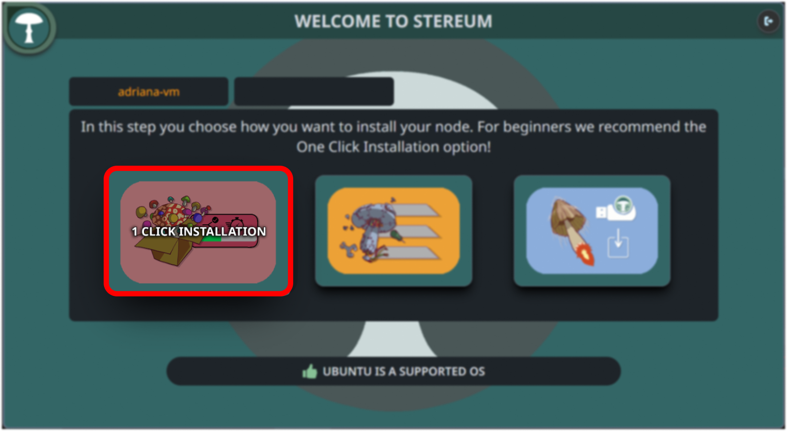
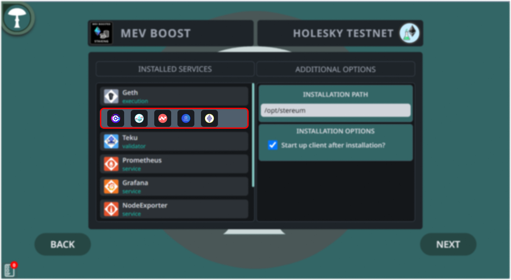
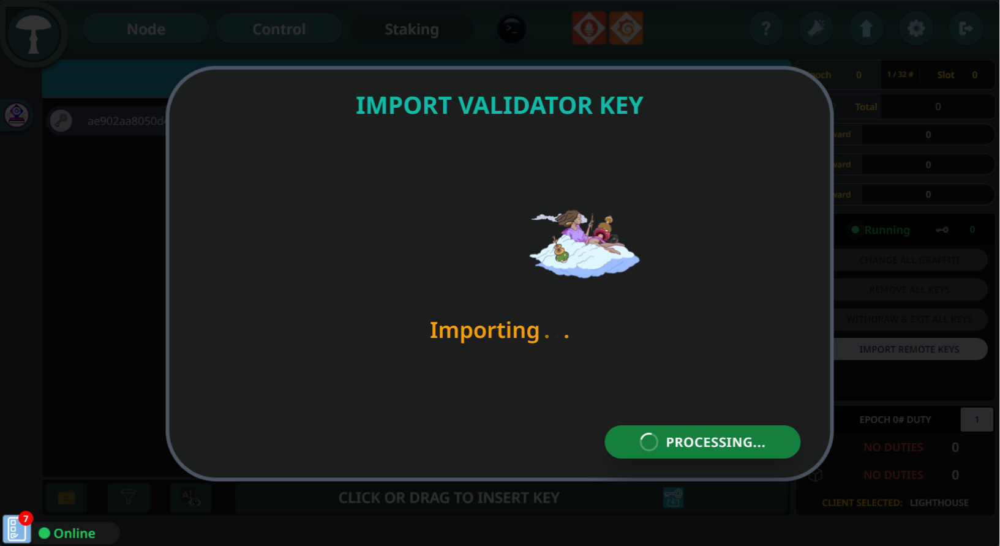

# MEV boosted Ethereum Solo Staking Guide

## Part 1 / 5 | Ethereum Node Setup

### Step 1
To begin setting up your server for crypto transactions with Stereum, start by logging into your server management system. Enter the server's IP address, username, and password, then proceed to log in. This step is critical for establishing a secure connection to your server where the node will be installed.

### Step 2
Once logged in, navigate to the server configuration dashboard. Look for the "One Click Installation" option which is recommended for beginners due to its simplicity and automated setup process. Select this to initiate the installation of your node with minimal hassle.

### Step 3
In the one-click installation section, choose your use case and network. For this guide, select the "MEV Boosting Staking" option to maximize rewards through this feature. From the network dropdown, pick an Ethereum testnet like Holesky.

### Step 4
Ensure you set the appropriate data path for your server by selecting the right storage volume. This step affects your node's performance and stability. For consensus any client works well. Set the installation directory, usually `/opt/stereum`, to keep your services well-organized for easy management.

### Step 5
Choose a block relay for MEV boosting by selecting one from the available options, such as Titan Relay or Flashbots. Move the selected relay to the "Used Block Relays" section by clicking the arrow button.

### Step 6
After selecting the appropriate block relay, proceed to the next step by clicking on "Next".

### Step 7
The next step involves setting the synchronization method for your node clients. The recommended 'Checkpoint Sync' method allows a quicker synchronization with the blockchain by starting from a known good state. Choose a trusted source for your checkpoint, which will influence the integrity and reliability of your node's data.

### Step 8
Finally, you’ll confirm the installation paths for each component you’re setting up on your server. This summary screen lists all the chosen services with their respective categories and installation paths, ensuring you have a clear overview of where each service will reside on the server. It’s important to verify that each path is correct to prevent any future operational issues.

### Step 9
Continue & wait for the installation to complete. This process might take some time depending on the server and network conditions.

### Step 10
After completing the initial setup, you will be directed to the node page. Here, monitor the status indicators next to each client, which will initially appear as small red dots. These dots will turn green once the clients are successfully turned on. When this happens, proceed by clicking on the "Control" tab to manage your settings further.

### Step 11
On the "Control" page, keep an eye on the synchronization status of both blockchain clients. Typically, the Consensus Client synchronization completes before the Execution Client's process starts. It's important to allow both clients to fully synchronize to ensure your node operates correctly within the network.

## Part 2 / 5 | Validor Key Deposit Preparation 

### Step 11
Navigate to the Ethereum Launchpad website [https://launchpad.ethereum.org](https://launchpad.ethereum.org), which is the official portal for becoming an Ethereum validator. You can visit either the general launchpad or the Holesky testnet launchpad, based on your requirements. Click on "Become a Validator" to start the process of setting up and registering your node as a validator.

  
### Step 12
Carefully read through the advisory information provided on the launchpad site. 

### Step 13
These pages contain crucial details about the responsibilities and requirements of running a validator node, such as the Proof of Stake mechanism, deposits, and key management. Understanding these points is essential before you proceed.

### Step 14
Choose any of the Execution Clients listed, such as Geth or Nethermind, to process validator deposits.

### Step 15
Similarly, select any Consensus Client like Lighthouse or Prysm.

### Step 16
Decide on the number of validators you wish to operate. Input this number into the designated field.

### Step 17
Begin by selecting the operating system you're using to generate validator keys, as this will determine the appropriate version of the key generation tool for your setup.

### Step 18
Return to the staking launchpad page and confirm that you've securely stored your validator keys and written down your mnemonic phrase by checking the box. This step is essential for ensuring the security and recoverability of your staking operation. After confirming, click "CONTINUE" to proceed with the setup process.

## Part 3 / 5 | Validator Key Generation 

### Step 19
For a user-friendly experience, opt for the Wagyu Key Gen application. This graphical user interface (GUI) tool, developed by the ETH Staker community, simplifies the key generation process. Though other options are available, Wagyu is highly recommended for its ease of use. After clicking on "DOWNLOAD FROM GITHUB," locate and download the Wagyu version that corresponds to your operating system.

### Step 20
Once the Wagyu download is complete, launch the application. Before generating keys, switch to the network you plan to use by clicking the network selector. For enhanced security, disconnect from the internet while you generate your validator keys, as this step involves sensitive information that should remain private.

### Step 21
Read the information provided within the Wagyu Key Gen application carefully. When ready, initiate the creation of your secret recovery phrase by clicking "Create" and then "CREATE NEW SECRET RECOVERY PHRASE."

### Step 22
Securely record your Secret Recovery Phrase. It's vital to back it up accurately and in the correct order, as it is the only way to recover your funds if needed. The best practice for keeping this phrase secure is to write it down on paper and store it in a safe place. Remember, the security of your funds is as reliable as your backup.

### Step 23
After backing up your Secret Recovery Phrase, re-enter it in the Wagyu Key Gen tool to verify its accuracy. Click "Check" to confirm you've recorded it correctly, ensuring you can access your funds when necessary.

### Step 24
Enter how many validator keys you'd like to create and set a strong password for them. This password will be used to secure your validator keys, so make it complex and keep it safe.

### Step 25
If you want to set an Ethereum Withdrawal Address, enter it now. This is where your funds will be sent when you perform a withdrawal. It's optional at this stage but remember that the address must be under your control and can be linked to your secret recovery phrase later if not provided now.

### Step 26
Retype your password to confirm it. Make sure you re-enter the same password you chose for your validator keys. This step is crucial for the security of your keys and will be needed every time you perform important operations with your validator.

### Step 27
Click on "Browse" to open Windows Explorer and navigate to the folder where you want to save your validator key(s). It's important to choose a secure and backed-up location because these keys will control your validator. Once you've selected the folder, verify that the path is correct and click "Create" to generate your keys.

### Step 28
Allow some time for the Wagyu application to generate your secret recovery phrase. It's essential to wait until the process is complete, which may take up to 30 seconds or more, depending on the number of keys.

### Step 29
Once your keys are generated, a screen will confirm that the keys are successfully created and saved to the specified directory. Review the information to ensure all is in order, then you can close the Wagyu application.

## Part 4 / 5 | Validator Key Deposit

### Step 30
Revisit the Ethereum staking launchpad webpage where you initially started the validator setup process.

### Step 31
On the launchpad site, click on the area indicated to "Drag File To Upload or Browse" and select the "Deposit_Data_[TIMESTAMP].json" file that was generated earlier. This file contains the public key associated with your validator and is required to proceed with the staking process on the launchpad. After selecting the file, click "Continue".

### Step 32
You will be prompted to connect an Ethereum wallet, such as Metamask. This is necessary to make the deposit for your validator. Follow the instructions to securely connect your wallet to the staking launchpad. Once connected, you will be able to proceed with the deposit transaction.

### Step 33
Confirm that your MetaMask wallet is connected to the correct network and that you have enough Testnet ETH to cover the transaction gas fee.

### Step 34
Carefully read the summary page, which will show the number of validators you are setting up and the total amount of Testnet ETH required.

### Step 35
Check all the necessary boxes to acknowledge the risks and affirm that you understand the transaction is not reversible.

### Step 36
Ensure Metamask wallet shows as connected on the launchpad site. Confirm your network and balance are correct, as these are required for making the validator deposit.

### Step 37
Click on "Send Deposit" to initiate the deposit of your ETH. Confirm the transaction in your MetaMask wallet. Ensure you have sufficient balance to cover the deposit and the associated gas fees. After reviewing the transaction details, click "Confirm" to proceed.

### Step 38
After the deposit, monitor the status of your validator key. It will join a queue before it is activated. To check the status, visit one of the provided beacon chain explorers (beaconcha.in,, or holesky.beaconcha.in) and enter your validator public key to track the activation process.

## Part 5 / 5 | Validator Key Import & Further Configuration

### Step 39
Open the Stereum application and log into your server. Navigate to the "Staking" section. To import your validator key, click on the 'Click or Drag to Insert Key' area or simply drag and drop your validator key file onto it.

### Step 40
Once you click or drag to insert the key, a file explorer will open. Navigate to the location of your validator key files, select them, and choose the validator client (like Lighthouse, Prysm, etc.) that you want to import your keys into. This is where you specify which client will manage your validator duties.

### Step 41
A dialogue will appear asking if you want to import with a Slashing Protection Database. Choose "No" if you have not previously imported these keys into a different client or if this is your initial setup. Click "Import" to proceed with importing your validator key without the Slashing Protection Database. This will initiate the import process for your validator key into the client.

### Step 42
Enter the password you created for your validator keys during their generation phase.

### Step 43
After entering your password and confirming the action, wait for the Stereum system to import your validator keys. This process will integrate your keys with the client and prepare it for staking operations.

### Step 44
Wait for the import process to complete. The interface will indicate when the validator key has been successfully imported into Stereum.

### Step 45
To set up block rewards, navigate to the "Node" tab and access the settings of your Validator Client.

### Step 46
Find the "Default Fee Recipient" section and click the pencil icon to edit the address to which block rewards will be sent.

### Step 47
After entering your chosen address, confirm and apply the changes by clicking "Confirm & Restart." Your Validator Client will restart to apply these settings. If it does not automatically restart, do it manually.

### Step 48
Once your node is fully synchronized with the network and your validator key has been processed through the deposit queue, you will begin to perform attestation duties. This signals that you are actively participating in the network and can start earning rewards.

## How to modify Relay selection

### Access Header

Go back to your node page and choose the Flashbots MEV Boost symbol to proceed.

### Change Relays

To change or add new block relays, select from the available options displayed on the list.

