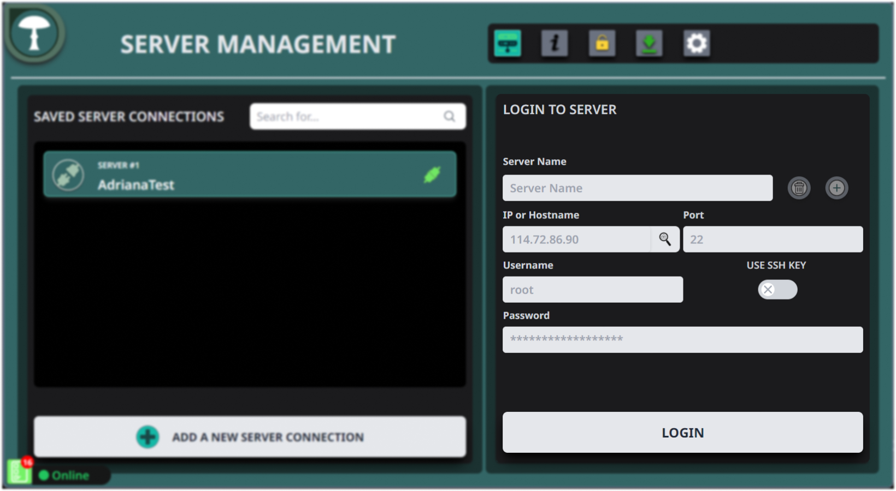

# Lido x SSV Network - SDVTM Guide

## Cluster Coordination Guide

### Step 1: Choose a Cluster Coordinator

Choose a cluster coordinator – this should be someone, who is technical adept and has some experience in setting up a SAFE Multisig and SSV Operator cluster.  

### Step 2: Collect and Verify Addresses

Use the provided form to collect each cluster member's addresses.
Each member must submit:

- **Required:** An individual manager address for the SAFE Multisig and SSV Operator setup.
- **Optional:** A reward address if you prefer to use a different address for collecting rewards.

**Important:** Ensure you have backed up and are in control of the private key(s) related to the addresses you submit.

### Step 3: Address Verification

<Tabs
  defaultValue="windows"
  values={[
    {label: 'EOA Verification', value: 'eoa'},
    {label: 'SAFE Multisig (ONLY FOR INDIVIDUAL REWARD ADDRESSES)', value: 'safe-multisig'},
  ]}>

  <TabItem value="eoa">

   1. **Sign the message on the Ethereum mainnet:**
   - Use your private key associated with the EOA.
   - Use a service like [Etherscan Verified Signatures](https://etherscan.io/verifiedSignatures).
   2. **Connect your wallet:**
      - Press the "Sign Message" button on Etherscan.
      - Input the address you are verifying (manager or reward address).
   3. **Enter the verification message:**
      - Use the following template:   
      `"<my name> is joining Lido x SSV cluster <cluster name> with address <public address>"`
   4. **Sign and publish the message:**
      - Once the message is successfully signed, publish it.
   5. **Submit the verified signature URL:**
      - Submit it via the form provided (e.g., https://etherscan.io/verifySig/27336).

  </TabItem>

  <TabItem value="safe-multisig">

   1. **Open your SAFE Multisig wallet:**
      - Go to the [Holesky SAFE interface](https://holesky-safe.protofire.io/welcome).
   2. **Create a new transaction:**
      - Hit the "New transaction" button.
      - Select "Contract interaction."
   3. **Toggle the "Custom data" switch:**
      - Enter any EOA address (e.g., `0x0000000000000000000000000000000000000000`) or your SAFE address.
   4. **Encode your message:**
      - Use a hex encoder like [Duplichecker](https://www.duplichecker.com/hex-to-text.php).
      - Use the following template:   
      `"<my name> is joining Lido x SSV cluster <cluster name> with address <public address>"`
      - Paste the hex-encoded message into the "Data (Hex encoded)" field (prepend "0x" if it's missing).
   5. **Submit the transaction:**
      - Set "ETH value" to 0.
      - Submit the transaction in the multisig interface.
   6. **Submit the verified address:**
      - Use the form provided by the Lido NOM team.

   </TabItem>

</Tabs>

### Step 4: Wait for Confirmation

Wait for confirmation from the Lido Team before proceeding further.

### Step 5: Create SAFE Multisig with your cluster

Once all addresses are verified, the **cluster coordinator** will create a 5/7 threshold SAFE Multisig. The Multisig will use each member's individual manager address on Holesky. 

### Step 6: Register Your Cluster

The Simple DVT Module Committee will add your cluster to the Lido Node Operator Registry using the SAFE multisig you provided.

## Lido x SSV Network Node Setup

### Step 7: Log into Your Server

To begin setting up your node server with Stereum, start by logging into your server. Enter the server's IP address, username, and password, then proceed to log in. This step is critical for establishing a secure connection to your server where the node will be installed.

### Step 8: One-Click Installation

Once logged in, look for the "One Click Installation" option which is recommended for beginners due to its simplicity and automated setup process. Select this to initiate the installation of your node with minimal hassle.

### Step 9: Select Network and Module

In the one-click installation section, select the "Lido x SSV SDVTM" option to participate as a Node operator for Lido. From the network dropdown, pick an Ethereum testnet like Holesky.

### Step 10: Set Data Path

Ensure you set the appropriate data path for your server by selecting the right storage volume. This step affects your node's performance and stability. For services, Geth is common for execution, and for consensus, any client works well. Set the installation directory, usually `/opt/stereum`, to keep your services well-organized for easy management.

### Step 11: Set Synchronization Method

The next step involves setting the synchronization method for your node clients. The recommended 'Checkpoint Sync' method allows quicker synchronization with the blockchain by starting from a known good state. Choose a trusted source for your checkpoint, which will influence the integrity and reliability of your node's data.

### Step 12: Confirm Installation Paths

Finally, confirm the installation paths for each component you’re setting up on your server. This summary screen lists all the chosen services with their respective categories and installation paths, ensuring you have a clear overview of where each service will reside on the server. It’s important to verify that each path is correct to prevent any future operational issues.

### Step 13: Complete Installation

Continue & wait for the installation to complete. This process might take some time depending on the server and network conditions.

### Step 14: Monitor Client Status

After completing the initial setup, you will be directed to the node page. Here, monitor the status indicators next to each client, which will initially appear as small red dots. These dots will turn green once the clients are successfully turned on – the only exception will be the SSV Network Service as well as the SSV DKG Service. When this happens, proceed by clicking on the "Control" tab to manage your settings further.

### Step 15: Synchronization Status

On the "Control" page, keep an eye on the synchronization status of both blockchain clients. Typically, the Consensus Client synchronization completes before the Execution Client's process starts. It's important to allow both clients to fully synchronize to ensure your node operates correctly within the network.

.) Confirm Change Log Settings
As we are tracking missed block proposals, we need to increase the duration that SSV Nodes store their logs. In your SSV Node Config, all operators need to edit the LogFileBackupsflag in the config.yaml file to the format below. Once done, save it and restart your operator. 

.) Add Flashbots MEV Relay 

https://0xafa4c6985aa049fb79dd37010438cfebeb0f2bd42b115b89dd678dab0670c1de38da0c4e9138c9290a398ecd9a0b3110@boost-relay-holesky.flashbots.net

### Step 16: Access SSV Network Features

Click on the SSV Network icon located at the top of the interface to access specific network features.

### Step 17: Generate Encrypted Operator Key Pair

In the SSV Network options, click "Generate" on the "Generate Encrypted Pair" section to secure your operator node with an encrypted key pair.

### Step 18: Set Operator Password

Enter a strong password to encrypt your operator key pair, then click "Generate". Download the backup of the encryption details for safekeeping.

### Step 19: Enter and Confirm Your Password

After setting your password for the encrypted operator key, click "Confirm" to secure the encryption settings and safeguard your key.

### Step 20: Confirm Warning

Acknowledge the warning by clicking "Confirm" to ensure that you have noted your password and understand the importance of keeping your backup secure.

### Step 21: Download Backup

Download a backup of the generated private key and password you used for encryption. This file should be kept in a safe location as it is critical for recovery and security.

### Step 22: Join as Operator

Once on the SSV Network website, click the "Join As Operator" button to participate as an operator, which involves managing validators and contributing to network operations.

### Step 23: Register as an Operator

After clicking "Join As Operator", select "Register Operator" to proceed with the registration process. This involves providing necessary details and your operator key to officially register as an operator on the network.

### Step 24: Approve Connection

On the SSV Network site, approve the connection request which allows the site to interact with your digital wallet (for example MetaMask) for necessary transactions and authorizations.

### Step 25: Unlock Your Ethereum Wallet

Unlock the Ethereum wallet of your choice by entering your password to authorize further operations and validate your identity as part of the operator registration process.

### Step 26: Connect to Your Ethereum Wallet

Finally, in your Ethereum wallet (for example, MetaMask), select the specific account you wish to use for the SSV Network operations and click "Connect" to establish the connection and complete the setup.

### Step 27: Paste Your Public Operator Key

Copy your Public Operator Key from the Stereum app and paste it into the field shown in your browser. This key allows you to be uniquely identified within the network, enabling other validators to select you as their operator.

### Step 28: Set Operator Fee

For the annual fee in SSV tokens, set them to zero.

### Step 29: Confirm Operator Fee and Details

After setting your fee, you will see a summary of the transaction details. Verify the information, especially the operator key and the annual fee, then click "Register Operator" to proceed.

### Step 30: Confirm Transaction in Ethereum Wallet

A confirmation request will appear in your Ethereum wallet of choice, for example, MetaMask. Review the transaction details, ensuring the fee and recipient details are correct, then confirm the transaction.

### Step 31: Transaction Confirmed

Once confirmed, you will see a transaction hash. You can click on this hash to view the transaction details on Etherscan or another blockchain explorer.

.) Communicate back your operator id to your cluster within your dedicated Discord group.

.) Set SSV Operator Private

.) SSV Whitelist Addresses

.) Once registered, fill-in the list of whitelisted addresses by following this guide on SSV docs. When providing addresses to be whitelisted, use the SAFE multi-sig address of the clusters you 

.) Configure the SSV DKG Service (Add Operator ID / Confirm and Restrart)

.) Enter your operator metadata:https://docs.ssv.network/operator-user-guides/operator-management/setting-operator-metadata (DKG Endpoint = IP: Copy IP Port: Default 3030)

⚠️ Do not Move Forward Without Confirmation⚠️

-) Log into your server with SSH, use the command, download keystore file

## SSV DKG - Leader Flow

After the multi-sig has been created and the Lido team has confirmed your cluster to move forward, the cluster coordinator (the “Leader”) will be responsible for setting up validators through the Lido Node Operator registry.

Each cluster coordinator will create a total of 5 validator keys using the SSV based DKG. After the first 1 week monitoring period is complete, additional keys will be generated.

Prerequisites (Holesky SSV cluster multisig funding)
head over to SSV's faucet (faucet.ssv.network)
switch to Holesky network
connect your cluster Multisig via Walletconnect
request for testnet SSV tokens
Distribute Validator (SSV Registration)
Here is a summary of the steps necessary to distribute validators on the SSV network:

Generate Validator keys with SSV-DKG-Onboard CLI
Register Validator to SSV network using SAFE transaction builder
Add Validators to the Lido Node Operator Registry
1. Generate Validators keys
Validator keys generation and registration to SSV is done via the SSV-DKG-Onboard CLI which generates validator keys using DKG and builds their transaction payload for registration in the SSV contract.

Run the SSV-DKG-Onboard CLI to generate 5 validators using the following command:

Please note to replace the [MULTISIG_ADDRESS] with your Cluster's multisig address
Please note to replace [OPERATOR_IDS] to the operator ids of your cluster
DO NOT CHANGE THE withdrawal-address
[OPERATOR_IDS] has to be a list in ascending order. For example:
1,2,3,4 ✅
4,1,2,3 ❌
Copy
docker pull bloxstaking/ssv-dkg-onboard:latest && \
docker run --rm -v $(pwd)/onboard:/data bloxstaking/ssv-dkg-onboard:latest \
--withdrawal-address 0xF0179dEC45a37423EAD4FaD5fCb136197872EAd9 \
--validator-count 5 \
--deposit-amount 10 \
--owner-address [MULTISIG_ADDRESS] \
--operators [OPERATOR_IDS (Note: they must be in ascending order)]
the --deposit-amount parameter relates to the SSV tokens needed to pay network fees. Please leave it untouched.
The tool will generate a folder named onboard (if that does not exist), and inside it, there will be a folder named with the following pattern: <year>-<month>-<day>__<hour>-<minute>-<second>. Inside it, you should find these files:

Copy
📂 <year>-<month>-<day>__<hour>-<minute>-<second>
├── 📄 deposit-data.json # aggregated deposit-data for all the generated validators
├── 📄 registration-transaction-data # transaction data to bulk register the validators
└── 📂 internal # deposit-data and keyshares for each generated validator
You will be using the registration-transaction-data in the next step, and deposit-data.json in the last one.

If the DKG ceremony fails:

Go to ceremony folder, it should look like this:
Copy
📂 <year>-<month>-<day>__<hour>-<minute>-<second>
├── 📄 FAILED # File containing final error message
├── 📄 inputs.json # file containing the inputs provided to the DKG tool
└── 📂 internal 
		├── 📄 console.log # printout of the console log
		└── 📄 dkg.log # file containing the debug logs of the DKG tool
Open the file named dkg.log as shown above
Scroll down all the way and copy error in the discord channel
2. Register Validators to SSV
To register validators to the SSV network, you will be using SAFE UI to build a batch of transactions, then sign and execute them all together:

Spending approval of SSV tokens by the SSV contract
Validator registration
Update of cluster Fee recipient
To start, head over to the SAFE UI select New transaction and then click on Transaction Builder

image
image
Prepare a transaction to Approve SSV spending to the SSV network contract.
In the form, paste this address 0xad45A78180961079BFaeEe349704F411dfF947C6 in the Enter Address field
The form will process the contract ABI and adapt. Enter the following values in the new fields
0x38A4794cCEd47d3baf7370CcC43B560D3a1beEFA → spender (address)
9999999999999999999999999999999999999999999  → amount (uint256)
Click Add transaction. The transaction has now been added to the batch (visibile on the right side of the screen)
image
Now prepare a transaction to register 5 validators:
toggle Custom data in the top right of the form
image
change the value of Enter Address field to 0x38A4794cCEd47d3baf7370CcC43B560D3a1beEFA
Select the option Use Implementation ABI in the pop-up
image
Fill the rest of the form with the following values (use the image below for reference)
ETH value → 0
Data → (clear the field first) copy the content of registration-transaction-data file from previous step
Click Add transaction button
image
Finally, prepare a transaction to configure fee recipient:
Disable the Custom data toggle
image
In the Contract Method Selector at the bottom, select the method (see image below):
Enter the address 0xE73a3602b99f1f913e72F8bdcBC235e206794Ac8 in the Recipient address field
Click Add transaction and Create Batch buttons
image
Click Send Batch
image
Click Sign
Notify the other operators in your cluster to sign this transaction in the safe interface
Once you are sure the transactions has been signed and executed, head over to SSV Scan (make sure Holesky network is selected), enter the multisig address to confirm validators have been registered.
Verify Validators are Registered to the correct Node Operators
Find and copy your cluster SAFE address
image
Paste Address in SSV Scan cluster search
image
Select the cluster ties to the SAFE address
image
Verify that the cluster has the newly registered validators associated with it and that all of the operator IDs are correct. Double check that each Operator node is online.
image