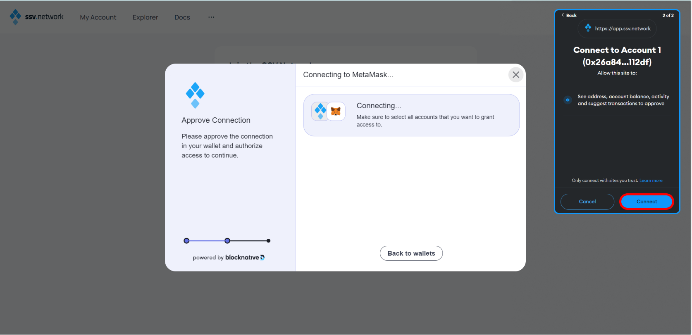

# Lido x SSV Network - SDVTM Guide

## Cluster Coordination Guide

### Step 1: Choose a Cluster Coordinator

1. **Select a cluster coordinator:**

Choose a cluster coordinator – this should be someone, who is technical adept and has some experience in setting up a SAFE Multisig and SSV Operator cluster.  

### Step 2: Collect and Verify Addresses

Use the provided form to collect each cluster member's addresses.
Each member must submit:

- **Required:** An individual manager address for the SAFE Multisig and SSV Operator setup.
- **Optional:** A reward address if you prefer to use a different address for collecting rewards.

**Important:** Ensure you have backed up and are in control of the private key(s) related to the addresses you submit.

### Step 3: Address Verification

#### EOA Verification

<!--DOCUSAURUS_CODE_TABS-->

<!-- Sign Message-->

1. **Sign the message on the Ethereum mainnet:**
   - Use your private key associated with the EOA.
   - Use a service like [Etherscan Verified Signatures](https://etherscan.io/verifiedSignatures).

<!-- Connect Wallet-->

2. **Connect your wallet:**
   - Press the "Sign Message" button on Etherscan.
   - Input the address you are verifying (manager or reward address).

<!-- Enter Message-->

3. **Enter the verification message:**
   - Use the following template:   
     `"<my name> is joining Lido x SSV cluster <cluster name> with address <public address>"`

<!-- Sign and Publish-->

4. **Sign and publish the message:**
   - Once the message is successfully signed, publish it.

<!-- Submit Signature-->

5. **Submit the verified signature URL:**
   - Submit it via the form provided (e.g., https://etherscan.io/verifySig/27336).

<!--/DOCUSAURUS_CODE_TABS-->

#### SAFE Multisig Verification (ONLY for Individual Reward Addresses)

<!--DOCUSAURUS_CODE_TABS-->

<!-- Open SAFE Multisig-->

1. **Open your SAFE Multisig wallet:**
   - Go to the [Holesky SAFE interface](https://holesky-safe.protofire.io/welcome).

<!-- Create New Transaction-->

2. **Create a new transaction:**
   - Hit the "New transaction" button.
   - Select "Contract interaction."

<!-- Toggle Custom Data-->

3. **Toggle the "Custom data" switch:**
   - Enter any EOA address (e.g., `0x0000000000000000000000000000000000000000`) or your SAFE address.

<!-- Encode Message-->

4. **Encode your message:**
   - Use a hex encoder like [Duplichecker](https://www.duplichecker.com/hex-to-text.php).
   - Use the following template:   
     `"<my name> is joining Lido x SSV cluster <cluster name> with address <public address>"`
   - Paste the hex-encoded message into the "Data (Hex encoded)" field (prepend "0x" if it's missing).

<!-- Submit Transaction-->

5. **Submit the transaction:**
   - Set "ETH value" to 0.
   - Submit the transaction in the multisig interface.

<!-- Submit Address-->

6. **Submit the verified address:**
   - Use the form provided by the Lido NOM team.

<!--/DOCUSAURUS_CODE_TABS-->

### Step 4: Wait for Confirmation

1. **Pause and Wait:**
   - Wait for confirmation from the Lido Team before proceeding further.

### Step 5: Create SAFE Multisig

1. **Coordinator Action:**
   - Once all addresses are verified, the cluster coordinator will create a 5/7 threshold SAFE Multisig.
   - The Multisig will use each member's individual manager address on Holesky.

2. **Share SAFE URL:**
   - Share the SAFE Holesky URL with the cluster members.

### Step 6: Register Your Cluster

1. **Committee Action:**
   - The Simple DVT Module Committee will add your cluster to the Lido Node Operator Registry using the SAFE multisig you provided.

## Lido x SSV Network Node Setup

### Step 7: Log into Your Server

To begin setting up your node server with Stereum, start by logging into your server. Enter the server's IP address, username, and password, then proceed to log in. This step is critical for establishing a secure connection to your server where the node will be installed.

### Step 8: One-Click Installation

Once logged in, look for the "One Click Installation" option which is recommended for beginners due to its simplicity and automated setup process. Select this to initiate the installation of your node with minimal hassle.

### Step 9: Select Network and Module

In the one-click installation section, select the "Lido x SSV SDVTM" option to participate as a Node operator for Lido. From the network dropdown, pick an Ethereum testnet like Holesky.

### Step 10: Set Data Path

Ensure you set the appropriate data path for your server by selecting the right storage volume. This step affects your node's performance and stability. For services, Geth is common for execution, and for consensus, any client works well. Set the installation directory, usually `/opt/stereum`, to keep your services well-organized for easy management.

### Step 11: Set Synchronization Method

The next step involves setting the synchronization method for your node clients. The recommended 'Checkpoint Sync' method allows quicker synchronization with the blockchain by starting from a known good state. Choose a trusted source for your checkpoint, which will influence the integrity and reliability of your node's data.

### Step 12: Confirm Installation Paths

Finally, confirm the installation paths for each component you’re setting up on your server. This summary screen lists all the chosen services with their respective categories and installation paths, ensuring you have a clear overview of where each service will reside on the server. It’s important to verify that each path is correct to prevent any future operational issues.

### Step 13: Complete Installation

Continue & wait for the installation to complete. This process might take some time depending on the server and network conditions.

### Step 14: Monitor Client Status

After completing the initial setup, you will be directed to the node page. Here, monitor the status indicators next to each client, which will initially appear as small red dots. These dots will turn green once the clients are successfully turned on – the only exception will be the SSV Network Service as well as the SSV DKG Service. When this happens, proceed by clicking on the "Control" tab to manage your settings further.

### Step 15: Synchronization Status

On the "Control" page, keep an eye on the synchronization status of both blockchain clients. Typically, the Consensus Client synchronization completes before the Execution Client's process starts. It's important to allow both clients to fully synchronize to ensure your node operates correctly within the network.

### Step 16: Access SSV Network Features

Click on the SSV Network icon located at the top of the interface to access specific network features.

### Step 17: Generate Encrypted Operator Key Pair

In the SSV Network options, click "Generate" on the "Generate Encrypted Pair" section to secure your operator node with an encrypted key pair.

### Step 18: Set Operator Password

Enter a strong password to encrypt your operator key pair, then click "Generate". Download the backup of the encryption details for safekeeping.

### Step 19: Enter and Confirm Your Password

After setting your password for the encrypted operator key, click "Confirm" to secure the encryption settings and safeguard your key.

### Step 20: Confirm Warning

Acknowledge the warning by clicking "Confirm" to ensure that you have noted your password and understand the importance of keeping your backup secure.

### Step 21: Download Backup

Download a backup of the generated private key and password you used for encryption. This file should be kept in a safe location as it is critical for recovery and security.

### Step 22: Join as Operator

Once on the SSV Network website, click the "Join As Operator" button to participate as an operator, which involves managing validators and contributing to network operations.

### Step 23: Register as an Operator

After clicking "Join As Operator", select "Register Operator" to proceed with the registration process. This involves providing necessary details and your operator key to officially register as an operator on the network.

### Step 24: Approve Connection

On the SSV Network site, approve the connection request which allows the site to interact with your digital wallet (for example MetaMask) for necessary transactions and authorizations.

### Step 25: Unlock Your Ethereum Wallet

Unlock the Ethereum wallet of your choice by entering your password to authorize further operations and validate your identity as part of the operator registration process.

### Step 26: Connect to Your Ethereum Wallet

Finally, in your Ethereum wallet (for example, MetaMask), select the specific account you wish to use for the SSV Network operations and click "Connect" to establish the connection and complete the setup.

### Step 27: Paste Your Public Operator Key

Copy your Public Operator Key from the Stereum app and paste it into the field shown in your browser. This key allows you to be uniquely identified within the network, enabling other validators to select you as their operator.

### Step 28: Set Operator Fee

For the annual fee in SSV tokens, set them to zero.

### Step 29: Confirm Operator Fee and Details

After setting your fee, you will see a summary of the transaction details. Verify the information, especially the operator key and the annual fee, then click "Register Operator" to proceed.

### Step 30: Confirm Transaction in Ethereum Wallet

A confirmation request will appear in your Ethereum wallet of choice, for example, MetaMask. Review the transaction details, ensuring the fee and recipient details are correct, then confirm the transaction.

### Step 31: Transaction Confirmed

Once confirmed, you will see a transaction hash. You can click on this hash to view the transaction details on Etherscan or another blockchain explorer.

