# Lido CSM Operator Guide

## Part 1 / 4 | Node Setup
### Step 1
To begin setting up your server for crypto transactions with Stereum, start by logging into your server management system. Enter the server's IP address, username, and password, then proceed to log in. This step is critical for establishing a secure connection to your server where the node will be installed.

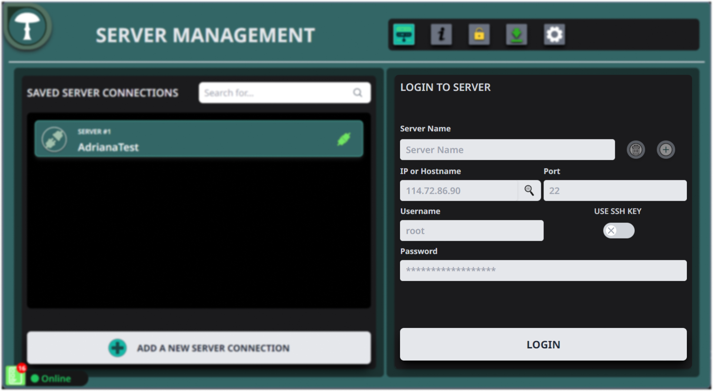

### Step 2
Once logged in, navigate to the server configuration dashboard. Look for the "One Click Installation" option which is recommended for beginners due to its simplicity and automated setup process. Select this to initiate the installation of your node with minimal hassle.

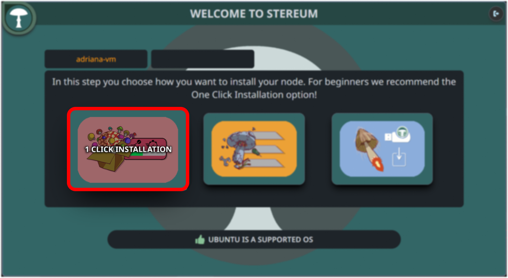

### Step 3
In the one-click installation section, choose your use case and network. For this guide, select the "CSM Node Operator" option to participate in blockchain validation and earning rewards. From the network dropdown, pick an Ethereum testnet like Holesky.

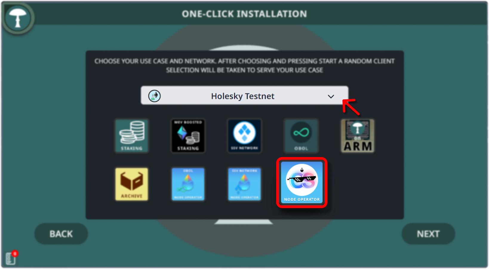

### Step 4
Ensure you set the appropriate data path for your server by selecting the right storage volume. This step affects your node's performance and stability. When setting up your node, try to alternate between different execution and consensus clients to optimize performance and network resilience. Set the installation directory, usually `/opt/stereum`, to keep your services well-organized for easy management.

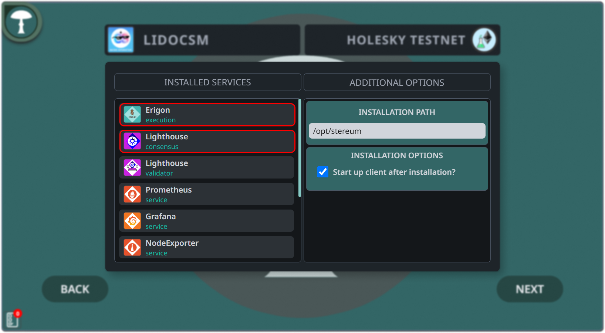

### Step 5
The next step involves setting the synchronization method for your node clients. The recommended 'Checkpoint Sync' method allows a quicker synchronization with the blockchain by starting from a known good state. Choose a trusted source for your checkpoint, which will influence the integrity and reliability of your node's data.

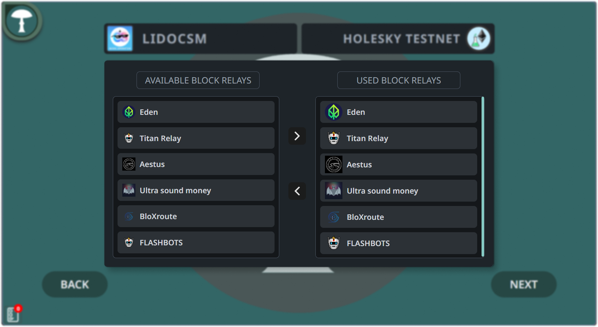

### Step 6
Choose from a range of block relays available for your node. Each relay offers different performance characteristics and geographical distribution. Select the block relays that best fit your operational requirements and expected validator performance.

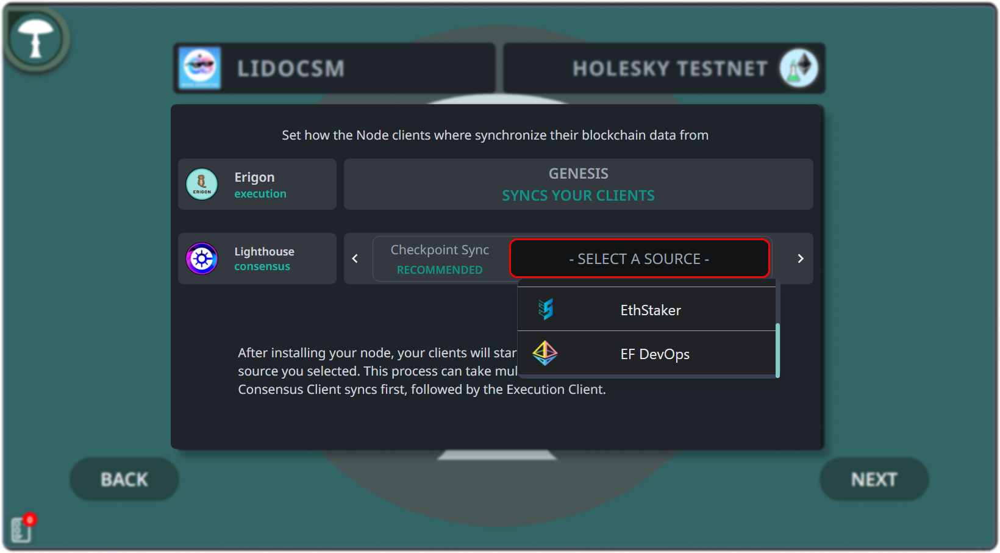

### Step 7
Finally, you’ll confirm the installation paths for each component you’re setting up on your server. This summary screen lists all the chosen services with their respective categories and installation paths, ensuring you have a clear overview of where each service will reside on the server. It’s important to verify that each path is correct to prevent any future operational issues.

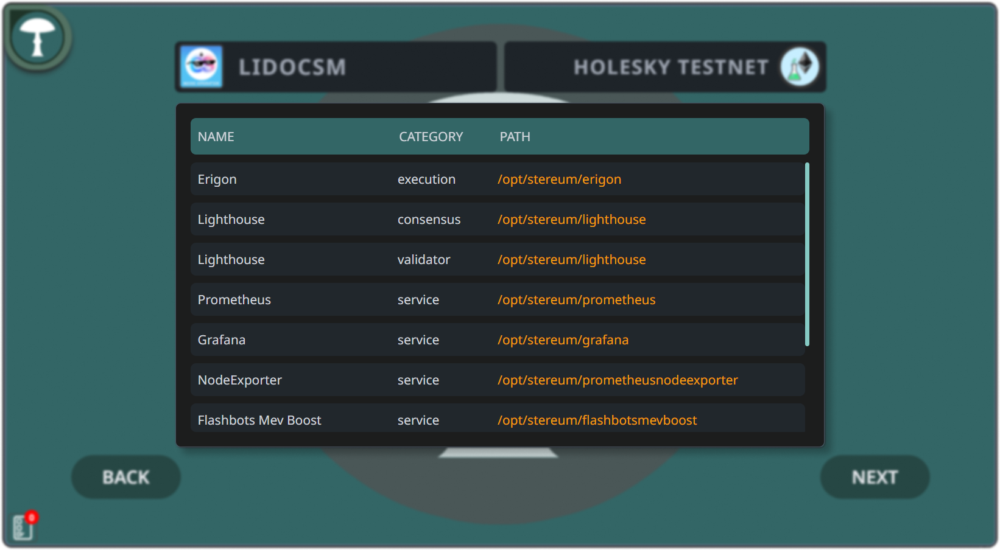

### Step 8
Continue & wait for the installation to complete. This process might take some time depending on the server and network conditions.

## Part 2 / 4 Validator Key Generation

### Step 9
Read the information provided within the Wagyu Key Gen application carefully. When ready, initiate the creation of your secret recovery phrase by clicking "CREATE NEW SECRET RECOVERY PHRASE."

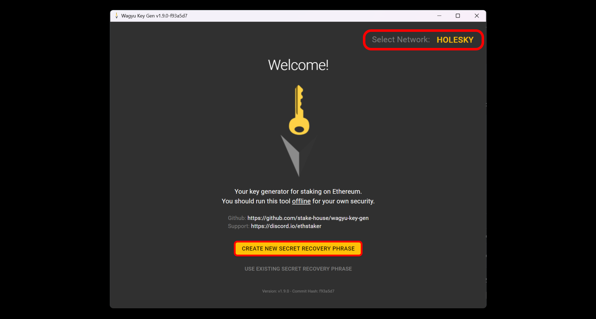

### Step 11
Securely record your Secret Recovery Phrase. It's vital to back it up accurately and in the correct order, as it is the only way to recover your funds if needed. The best practice for keeping this phrase secure is to write it down on paper and store it in a safe place. Remember, the security of your funds is as reliable as your backup.

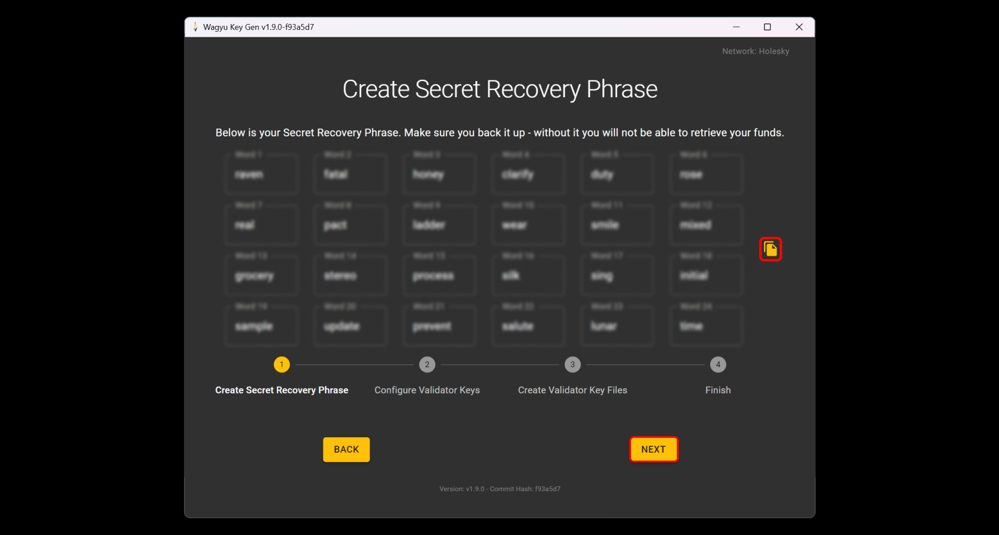

### Step 12
After backing up your Secret Recovery Phrase, re-enter it in the Wagyu Key Gen tool to verify its accuracy. Click "Check" to confirm you've recorded it correctly, ensuring you can access your funds when necessary.

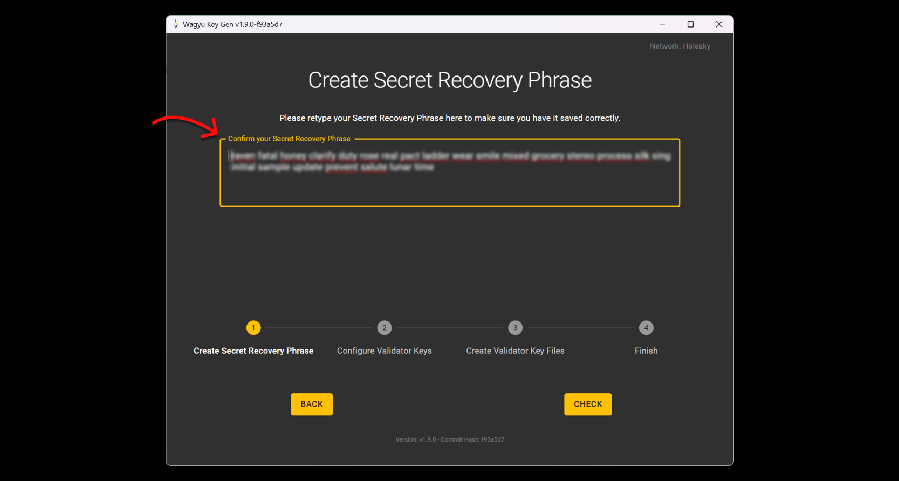

### Step 13
Enter how many validator keys you'd like to create and set a strong password for them. This password will be used to secure your validator keys, so make it complex and keep it safe.

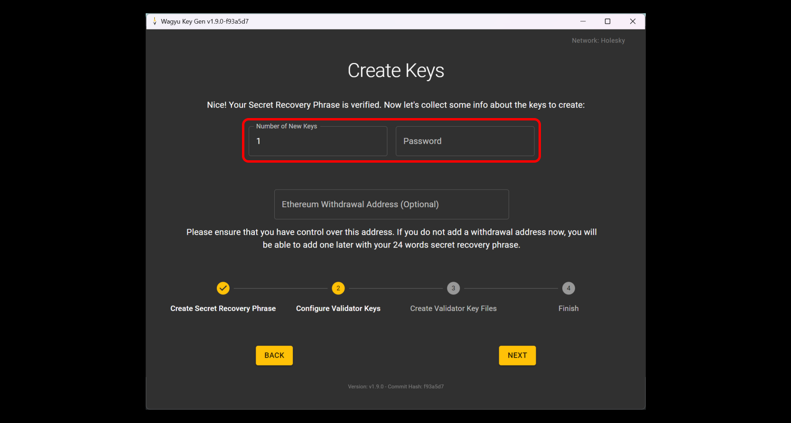

### Step 14
Now for the Withdrawal Address, enter the Withdrawal adress of the Lido Holesky CSM Smart Contract (Withdrawal: 0xF0179dEC45a37423EAD4FaD5fCb136197872EAd9). You can find it under this link: https://dvt-homestaker.stakesaurus.com/bonded-validators-setup/lido-csm/generating-csm-keystores.

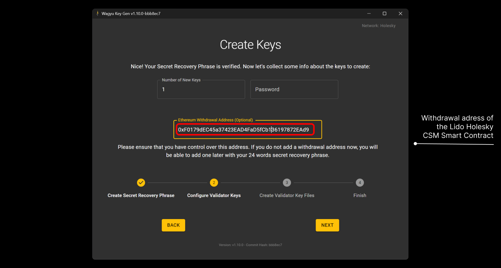

### Step 15
Retype your password to confirm it. Make sure you re-enter the same password you chose for your validator keys. This step is crucial for the security of your keys and will be needed every time you perform important operations with your validator.

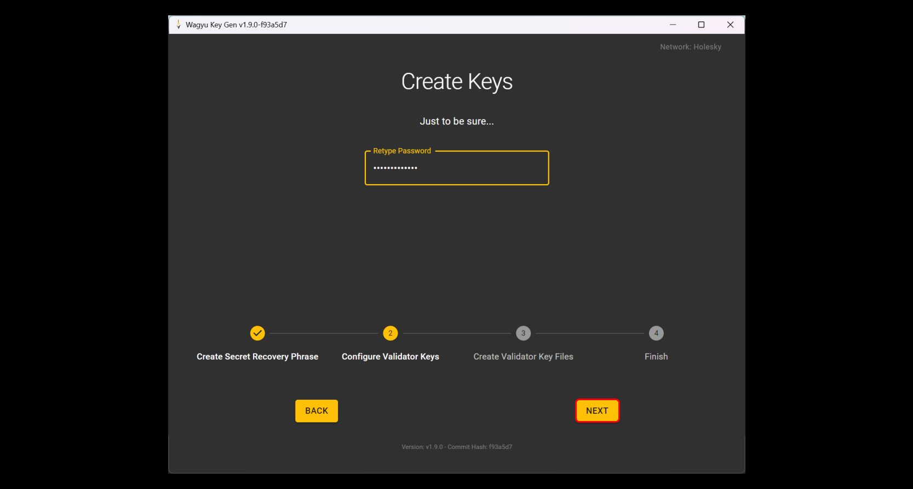

### Step 16
Click on "Browse" to open Windows Explorer and navigate to the folder where you want to save your validator key(s). It's important to choose a secure and backed-up location because these keys will control your validator. Once you've selected the folder, verify that the path is correct and click "Create" to generate your keys.

### Step 17
Once your keys are generated, a screen will confirm that the keys are successfully created and saved to the specified directory. Review the information to ensure all is in order, then you can close the Wagyu application.

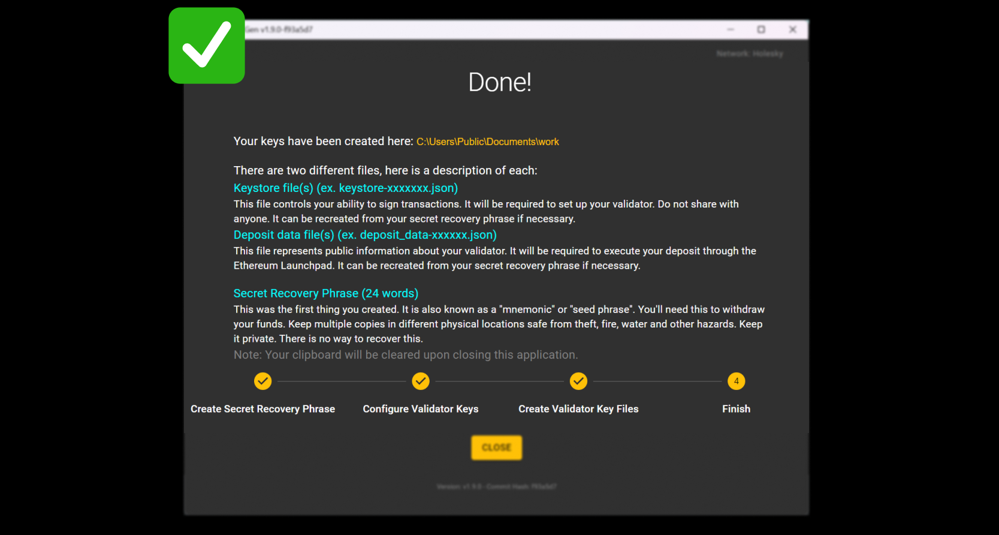

## Part 3 / 4 Lido CSM Node Operator registration

### Step 18
Acces the following link: https://csm.testnet.fi/. To participate as a Node Operator in the Community Staking Module, begin by clicking the I am a Node Operator button on the Lido CSM portal. This selection marks your intent to manage and operate nodes within the Lido on Ethereum protocol.

### Step 19
Next, connect your wallet to the platform. You can use MetaMask, Ledger, or any other supported wallets by selecting them from the list. This is crucial for transaction approvals and interactions on the network.

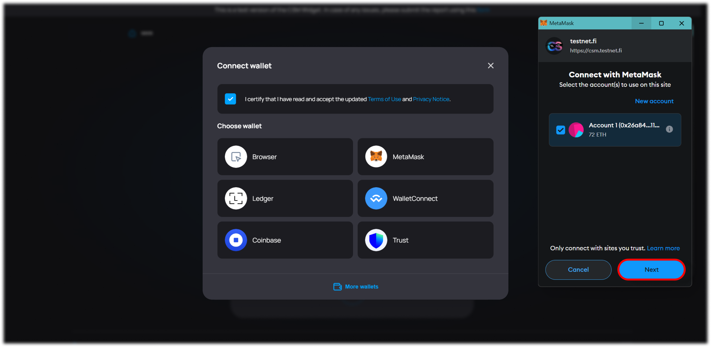

### Step 20
Choose the amount of ETH you wish to bond and upload the corresponding deposit data. Ensure you have the JSON file (the deposit data file from Wagyu Key Gen tool) ready as it contains necessary details for the bonding process. Click Submit to proceed.

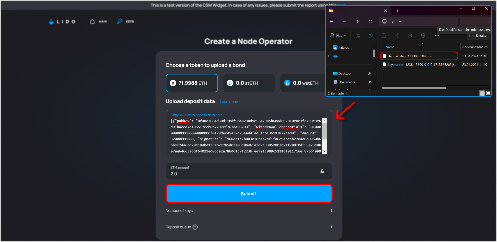

### Step 21
After submitting your bond, a confirmation dialogue will appear in your Ethereum wallet of choice, e.g., MetaMask. Review the transaction details thoroughly, then click Confirm to finalize your bond.

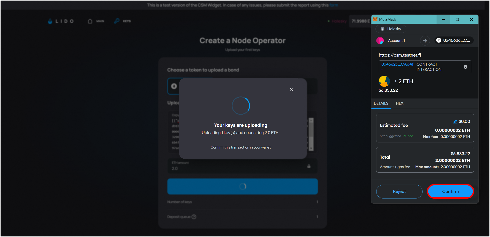

### Step 23
Wait for the transaction to process. This may take some time depending on network conditions. Meanwhile you can check the status of your transaction on://etherscan.io/

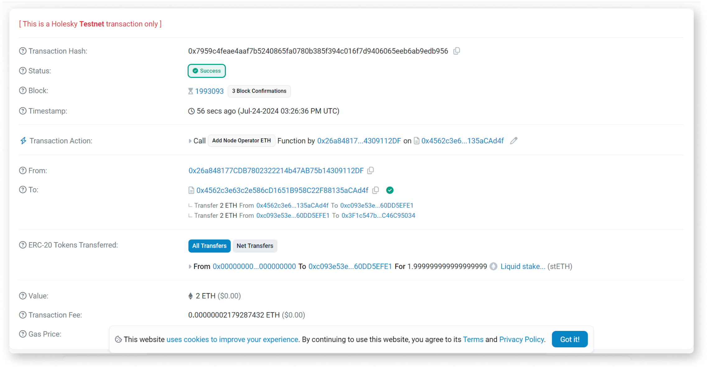

### Step 24
Finally, verify the status of the key deposited for you. 

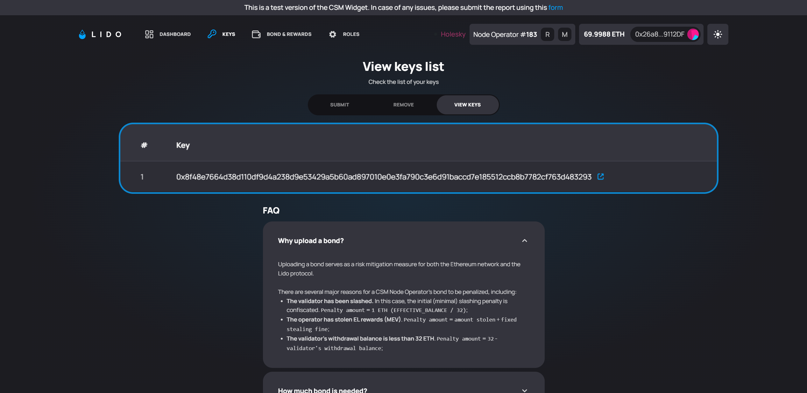

## Part 4 / 4 Validator Key Import

### Step 26
In Stereum, after completing the initial setup, you will be directed to the node page. Here, you can view and manage your node's configuration. Click on the "Open" button next to the setup you wish to configure or review.

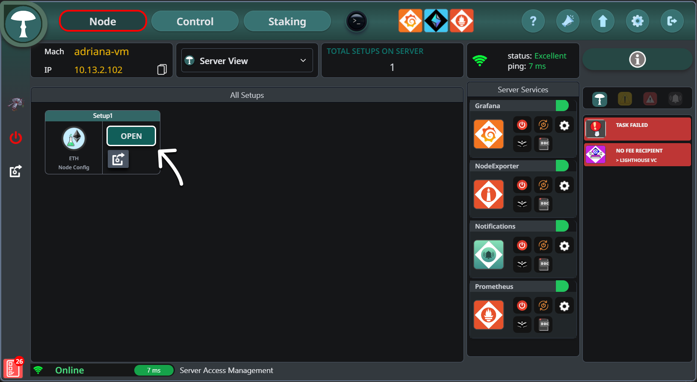

### Step 27
Once you've opened the node configuration and can view all three clients, proceed by clicking on the settings button for the validator client. This will allow you to adjust or verify specific settings for your validator operations.

### Step 28
Before restarting your node, recall that you will have to use a designated fee recipient address(0xE73a3602b99f1f913e72F8bdcBC235e206794Ac8) as a CSM operator, which is a key configuration for receiving transaction fees. You can find the necessary details on setting this up at Lido's specific guidance page: https://dvt-homestaker.stakesaurus.com/bonded-validators-setup/lido-csm/running-a-separate-vc-service#configure-the-separate-vc-service. After updating this setting in your node configuration, click on the Confirm & Restart button to apply the new configurations and restart the node.

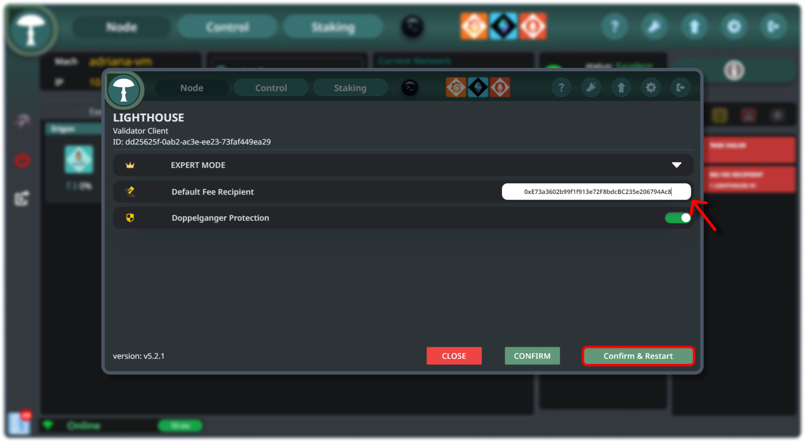

### Step 29
Once the validator client restarts, navigate to the Staking tab. Here, you can begin the process of inserting your validator key by clicking on the Click or Drag to Insert Key area.

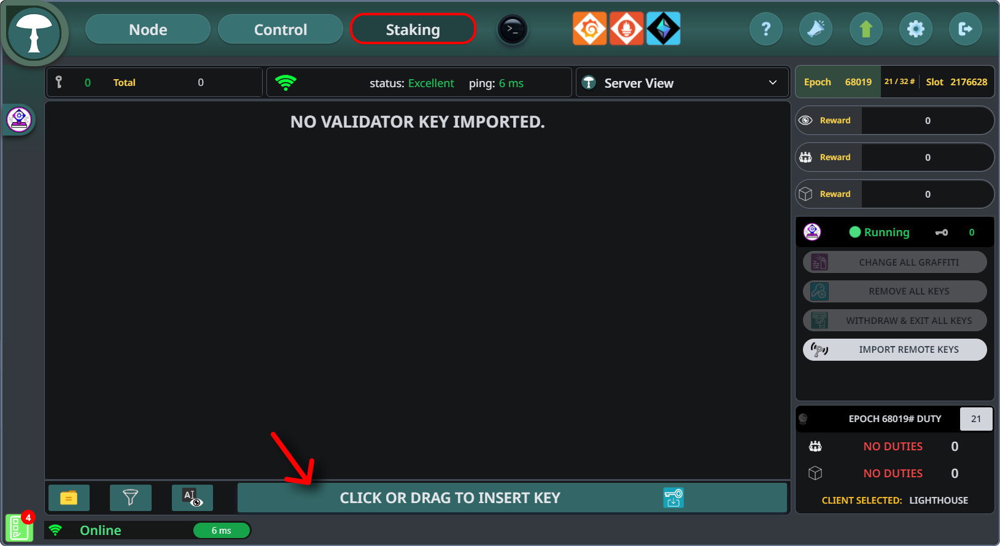

### Step 30
Select and import the validator key you have generated with the Wagyu generator. Ensure you choose the correct file that corresponds with your validator client settings.

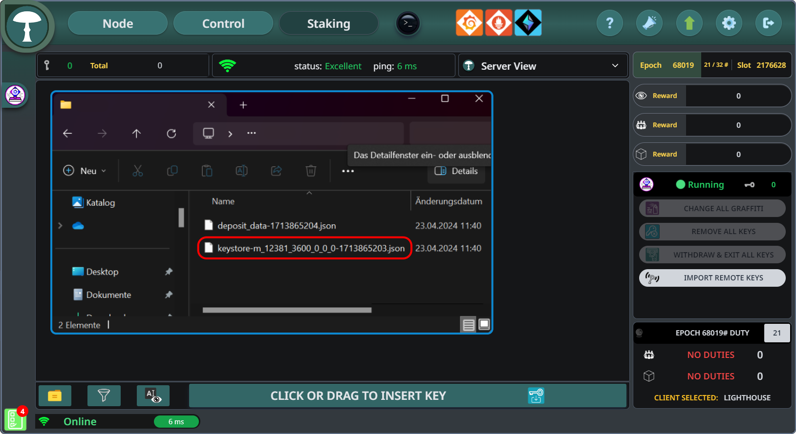

### Step 31
Approve the validator client you will use by selecting it.

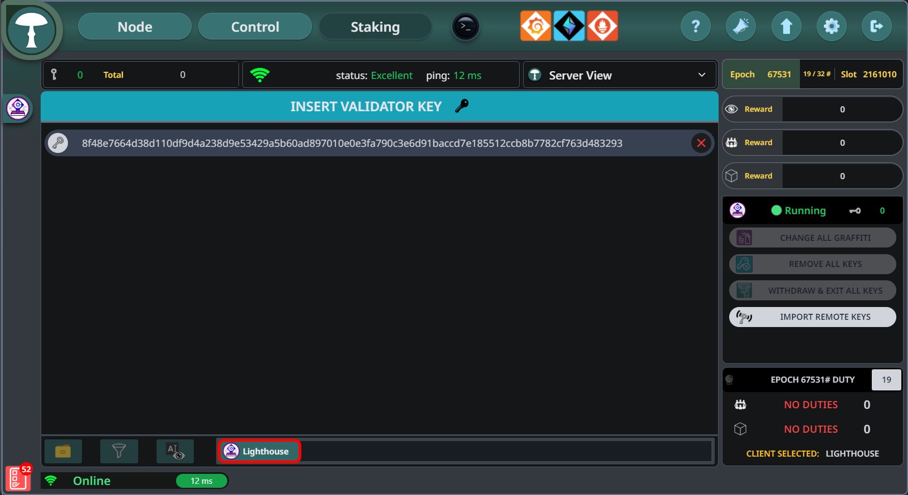

### Step 32
After selecting the validator key, you will be prompted to enter the password that you set up during the key generation in Wagyu. Input your password to authenticate and finalize the import process.

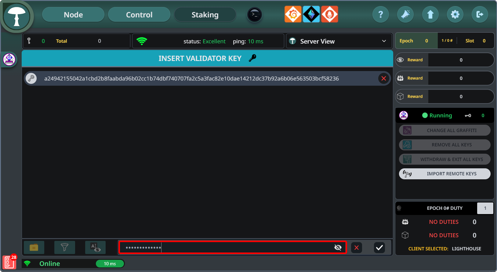

### Step 33
After importing your validator key, a confirmation screen will appear. If Doppelgänger Protection is enabled, you'll have the option to import with a Slashing Protection Database. Select 'Yes' to proceed with enhanced security measures or 'No' if you choose to bypass this step. Finally, click 'Import' to complete the setup of your validator key.

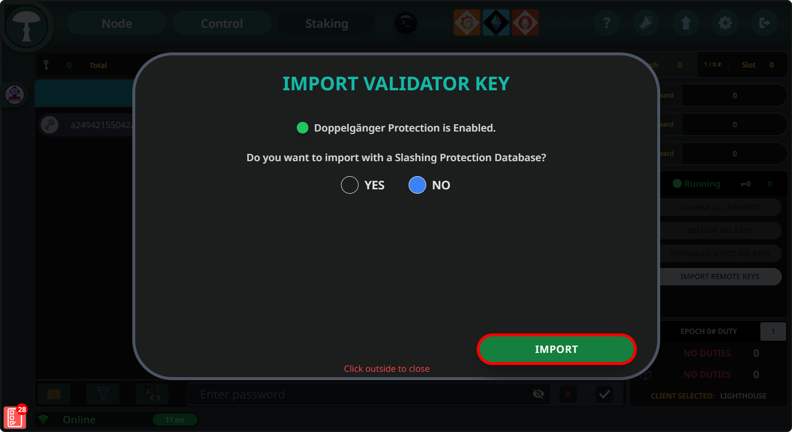

### Step 34
After selecting the "Import" option, you should see a confirmation that the validator key has been successfully imported. This will confirm the validator key's registration in the system.

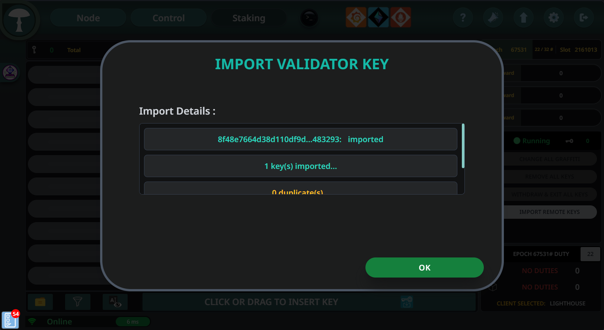

### Step 35
Once the key is imported, navigate to the "Staking" tab. You should see the validator key appear under the node tab, indicating that the key is active and the system recognizes your validator.

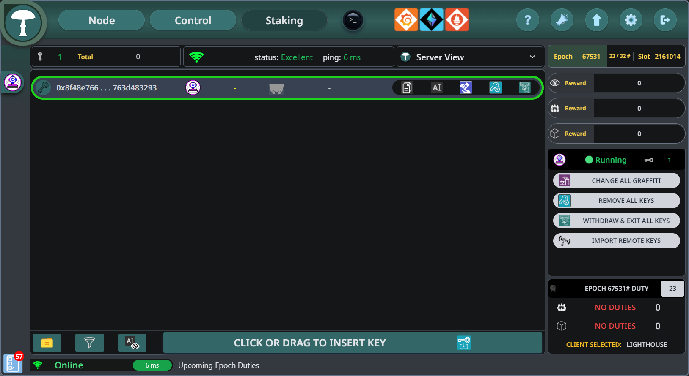