# SSV Network Node Operator Guide

## Part 1 / 2 | SSV Network Node Setup

### Step 1: Server Login
Open your server management dashboard to log in. Provide the server name, IP address, username, and password, or connect using an SSH key if configured.

### Step 2: Initiate One-Click Installation
Navigate to the "One Click Installation" feature in the welcome area, specifically designed to simplify the installation process for beginners.

### Step 3: Select the Network
Choose the appropriate network for your needs. For testing and development purposes, select "Holesky Testnet" by clicking on the "SSV Network" icon. For operating the node with real funds, select "Ethereum Mainnet" to ensure robust security and operational reliability.

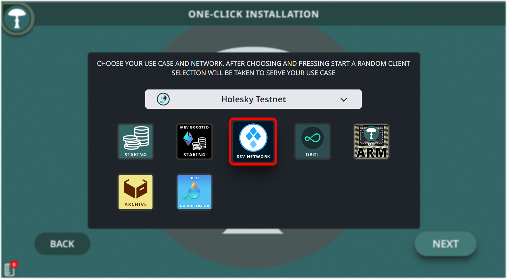

### Step 4: Configure Installation Path
Enter the correct installation path in the 'Installation Path' input field on your local server. Make sure to use the correct storage volume to prevent data issues.

### Step 5: Sync Settings
Change to "Checkpoint Sync" under sync options to decrease synchronization times. Select from the available checkpoints to reduce the sync period by days.

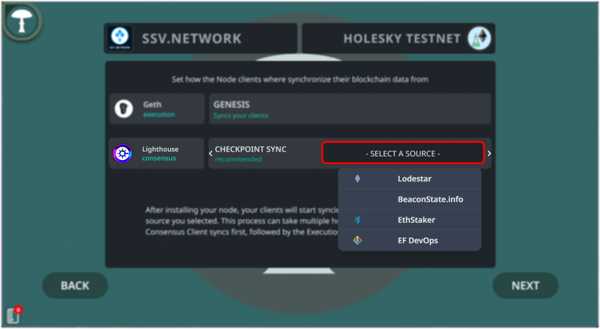

### Step 6: Complete Installation
Review your settings, then proceed with the installation by clicking 'Next'. The installation will continue, and you can track the progress on your dashboard.

### Step 7: Await Installation Completion
After setting your configurations, allow the installation to complete. 

### Step 8: Node Initialization
Once the initial setup finishes, you will land on the node page. Watch for the status indicators of each client; they must turn green from red, indicating they are active and running. Proceed to the "Control" tab once all clients are active.

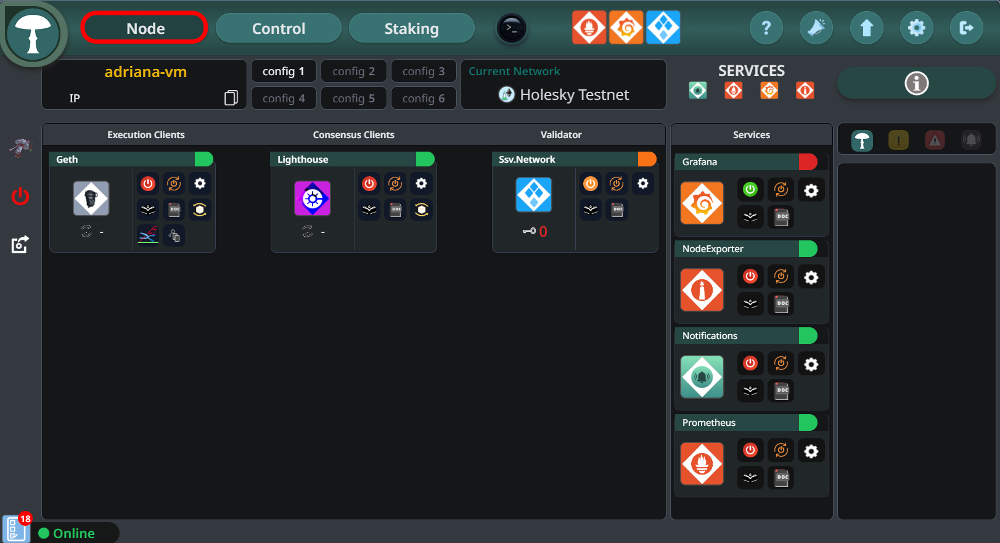

### Step 9: Synchronize Clients
Wait for the synchronization of both the Execution and Consensus clients. Typically, the Consensus Client synchronization completes before the Execution Client starts its process.

### Step 10: Access SSV Network Features
Click on the SSV Network icon located at the top of the interface to access specific network features.

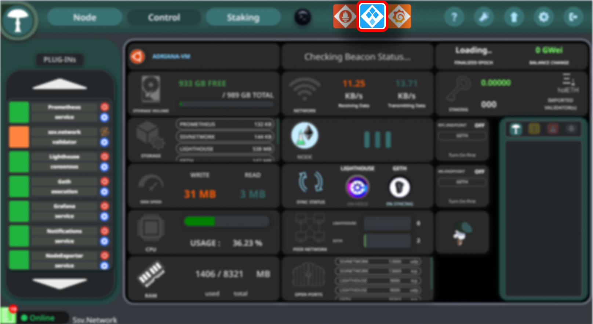

### Step 11: Generate Encrypted Operator Key Pair
In the SSV Network options, click "Generate" on the "Generate Encrypted Pair" section to secure your operator node with an encrypted key pair.

### Step 12: Set Operator Password
Enter a strong password to encrypt your operator key pair, then click "Generate". Download the backup of the encryption details for safekeeping.

### Step 13: Enter and Confirm Your Password
After setting your password for the encrypted operator key, click "Confirm" to secure the encryption settings and safeguard your key.

### Step 14: Confirm Warning
Acknowledge the warning by clicking "Confirm" to ensure that you have noted your password and understand the importance of keeping your backup secure.

### Step 15: Download Backup
Download a backup of the generated private key and password you used for encryption. This file should be kept in a safe location as it is critical for recovery and security.

### Step 16: Copy Public Operator Key and Register
In the Operator Dashboard, click "Copy" to copy your public operator key to the clipboard. Then, click "Open in Browser" to navigate to the SSV network site where you can complete your registration as an operator.

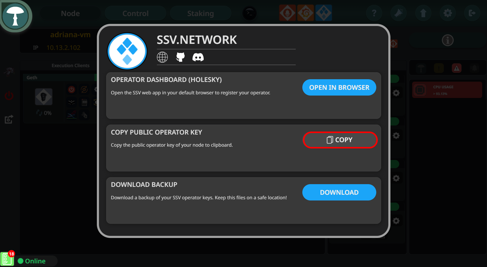

### Step 17: Press "Open in Browser"
Click the "Open in Browser" button on the Operator Dashboard interface to launch the web browser and direct it to the SSV Network website.

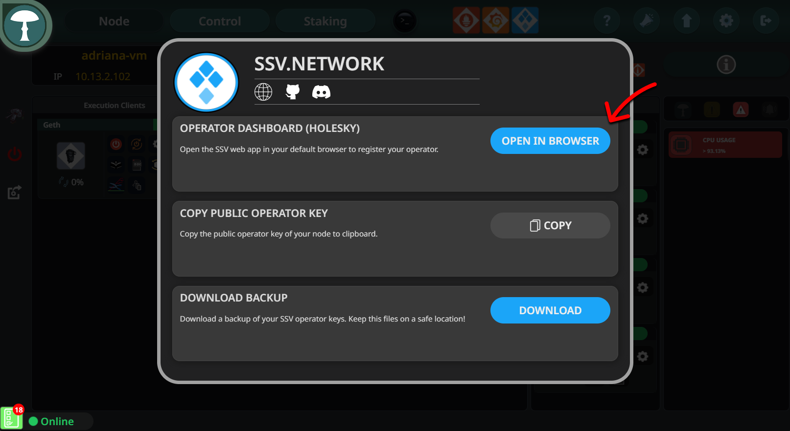

## Part 2 / 2 | Operator Registration 

### Step 18: Join as Operator
Once on the SSV Network website, click the "Join As Operator" button to participate as an operator, which involves managing validators and contributing to network operations.

### Step 19: Register as an Operator
After clicking "Join As Operator", select "Register Operator" to proceed with the registration process. This involves providing necessary details and your operator key to officially register as an operator on the network.

### Step 20: Approve Connection
On the SSV Network site, approve the connection request which allows the site to interact with your digital wallet (for example MetaMask) for necessary transactions and authorizations.

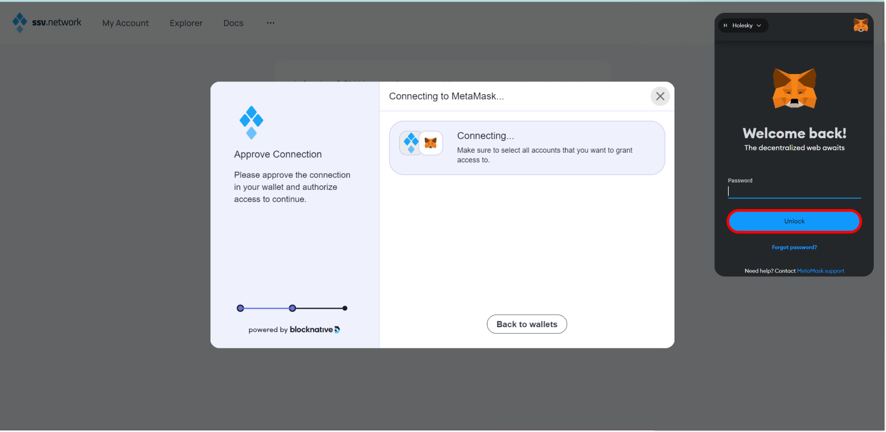

### Step 21: Unlock Your Ethereum Wallet
Unlock the Ethereum wallet of your choice by entering your password to authorize further operations and validate your identity as part of the operator registration process.

### Step 22: Connect to Your Ethereum Wallet
Finally, in your Ethereum wallet (for example, MetaMask), select the specific account you wish to use for the SSV Network operations and click "Connect" to establish the connection and complete the setup.

### Step 23: Paste Your Public Operator Key
Copy your Public Operator Key from the Stereum app and paste it into the field shown in your browser. This key allows you to be uniquely identified within the network, enabling other validators to select you as their operator.

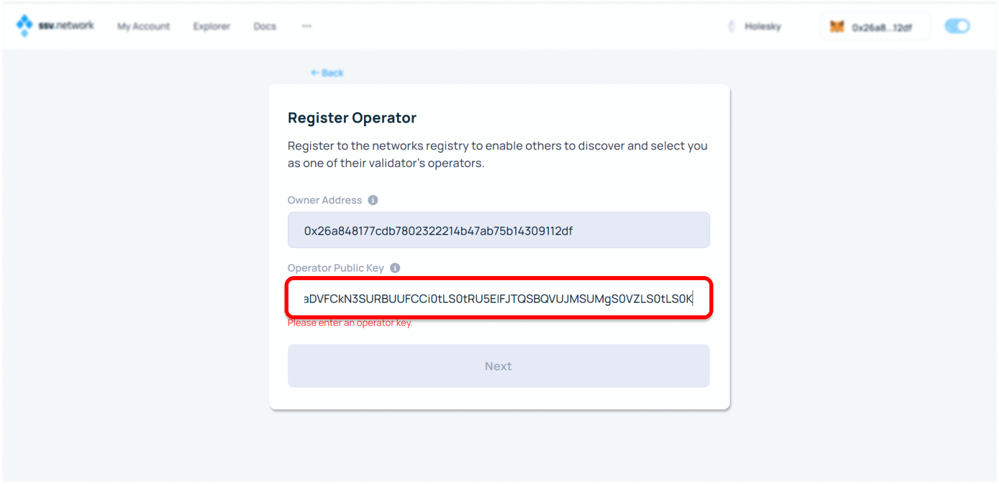

### Step 24: Set Operator Fee
Enter the annual fee in SSV tokens that you wish to charge validators for your services. This fee will be presented as an annual payment but is typically paid to operators continuously for each block processed.

### Step 25: Confirm Operator Fee and Details
After setting your fee, you will see a summary of the transaction details. Verify the information, especially the operator key and the annual fee, then click "Register Operator" to proceed.

### Step 26: Confirm Transaction in Ethereum Wallet
A confirmation request will appear in your Ethereum wallet of choice, for example, MetaMask. Review the transaction details, ensuring the fee and recipient details are correct, then confirm the transaction.

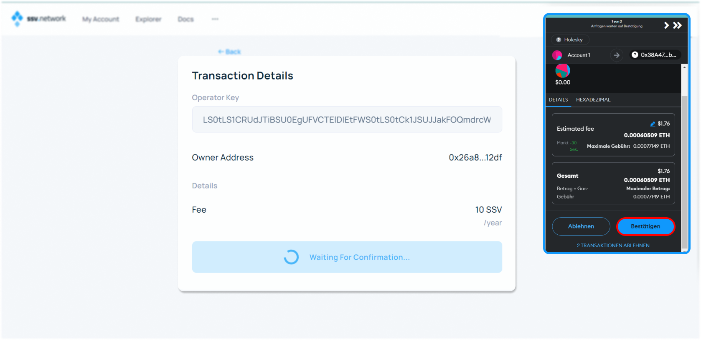

### Step 27: Transaction Confirmed
Once confirmed, you will see a transaction hash. You can click on this hash to view the transaction details on Etherscan or another blockchain explorer.

### Step 29: Welcome to the SSV Network
Congratulations! You are now an official operator on the SSV network. Your operator ID will be displayed, and you can now manage the validators associated with your node.

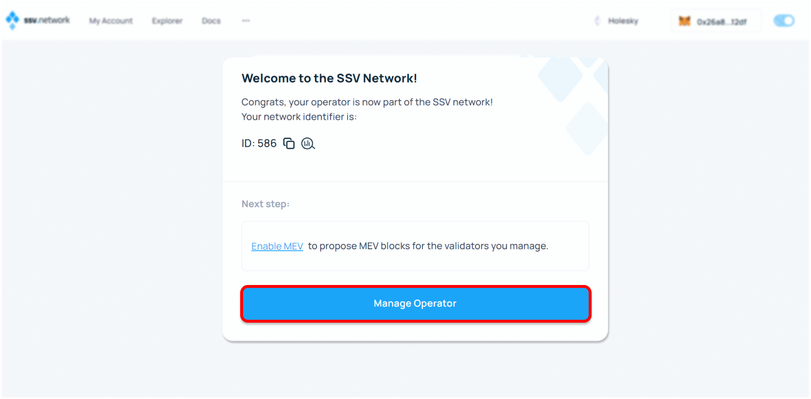

### Step 30: Manage Operators
After registering, you can view and manage your operators in the dashboard. Here, you can see each operator's ID, status, performance over the last 30 days, balance, yearly fee, and the number of validators. You can add more operators by clicking "Add Operator".

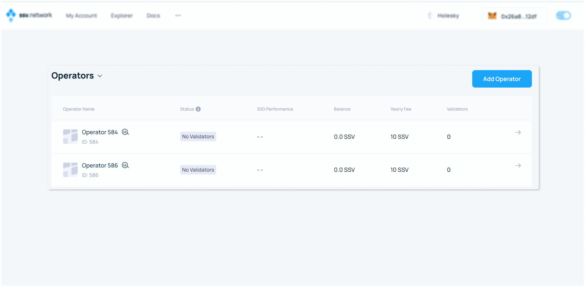

