import Tabs from '@theme/Tabs';
import TabItem from '@theme/TabItem';

# Intial Node Server Setup

## Cloud Server Setup

<Tabs
  defaultValue="stereumplus"
  values={[
    {label: 'StereumPlus', value: 'stereumplus'}
  ]}>

  <TabItem value="stereumplus">

  ### Get started with [StereumPlus](https://stereumplus.com/)

  #### Step 1
  Begin by clicking **"Buy Server"** in the top menu to start your journey toward becoming a node runner with StereumPlus.

  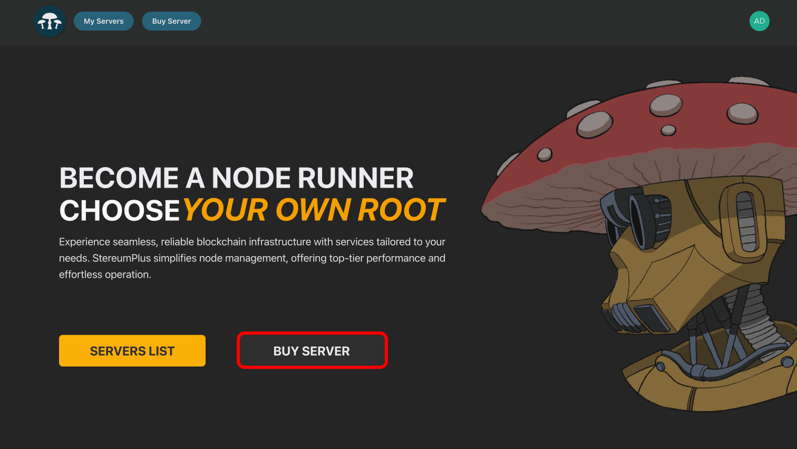

  #### Step 2
  Select your preferred **provider** from the dropdown list. This step ensures you choose a service suited to your blockchain needs.

  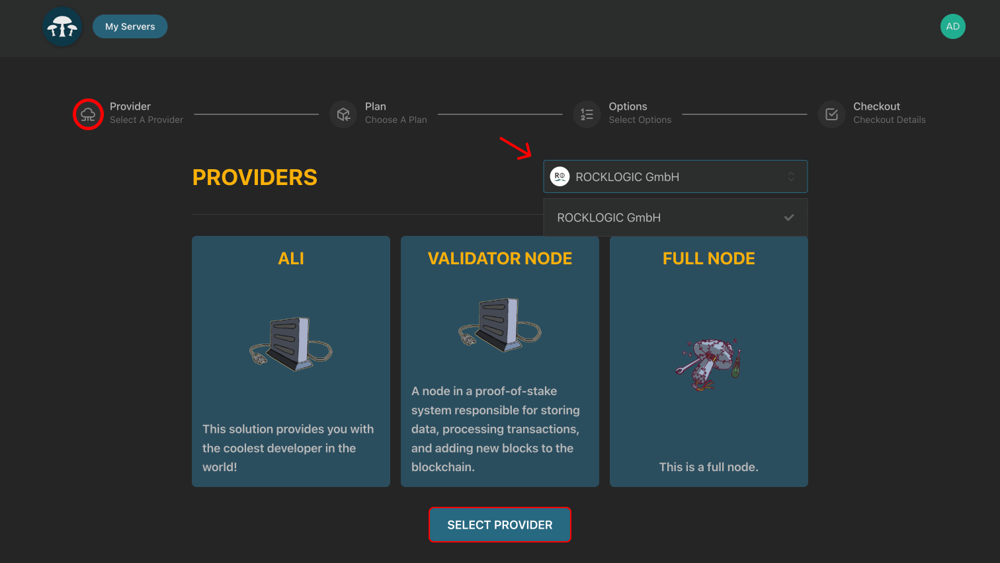

  #### Step 3
  Choose a **plan** based on your server requirements. Compare the options for cores, RAM, and storage to pick what fits best.

  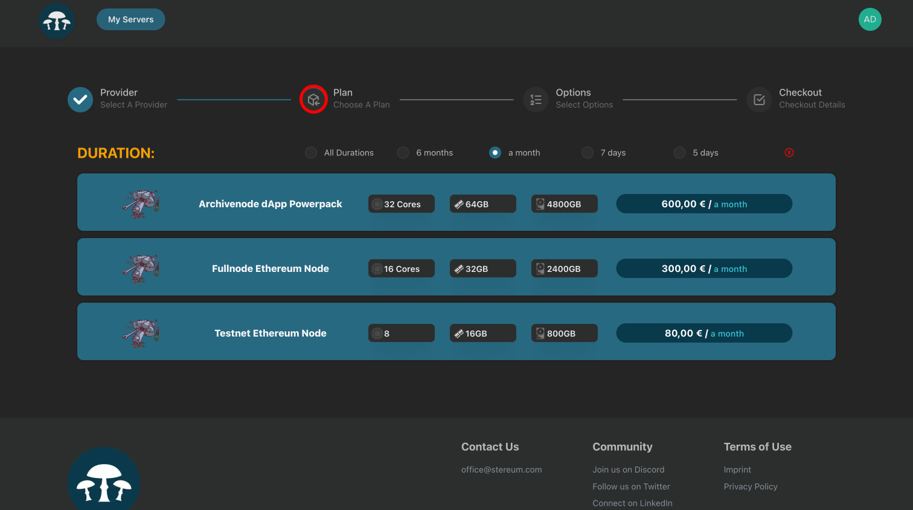

  #### Step 4
  Enter a unique **server name** to identify your node and click "Continue" to proceed.

  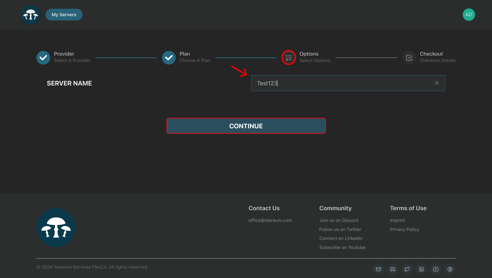

  #### Step 5
  Review your selected plan details, including price and specifications. Once satisfied, click **"Subscribe"** to continue.

  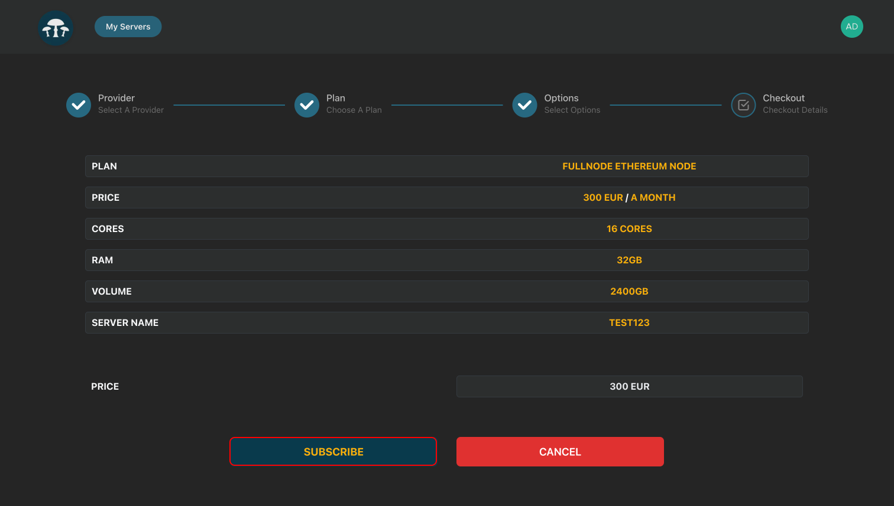

  ### Payment Process

  #### Step 6
  Select your preferred **cryptocurrency** (e.g., Ethereum, USDC, or USDT) for payment, then click **"Choose"**.

  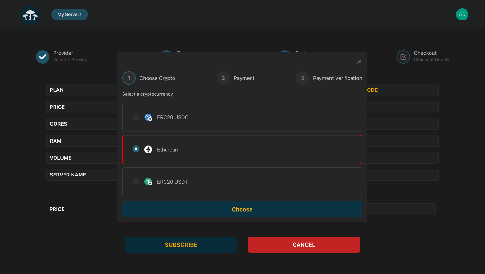

  #### Step 7
  A wallet address and payment amount will appear. Use the **QR code** or copy the wallet address to initiate the transaction.

  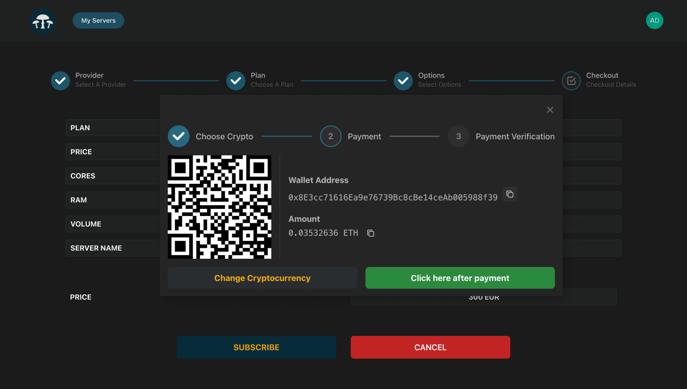

  #### Step 8
  Open your crypto wallet, select **"Send"**, and paste the wallet address provided by StereumPlus.

  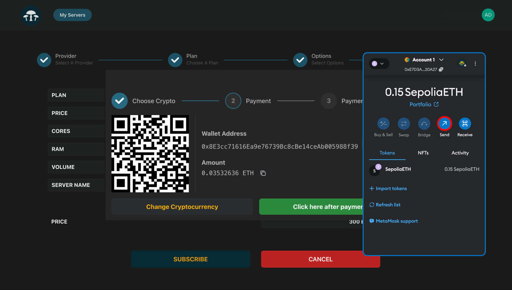

  #### Step 9
  Copy the wallet address displayed on the StereumPlus payment page to ensure it matches what you paste into your crypto wallet.  

  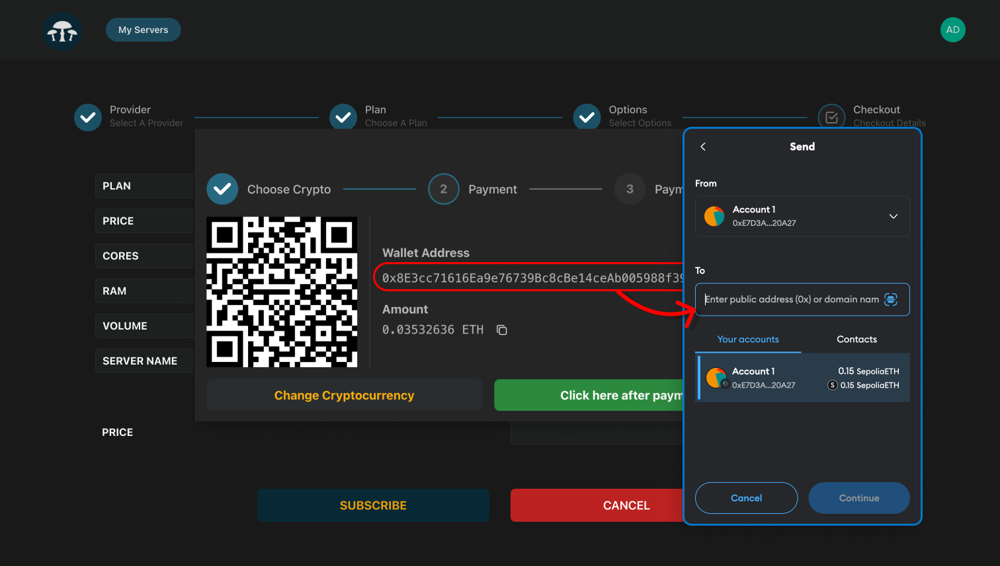

  #### Step 10
  Enter the exact amount shown on the payment screen in your wallet and confirm the transaction.  

  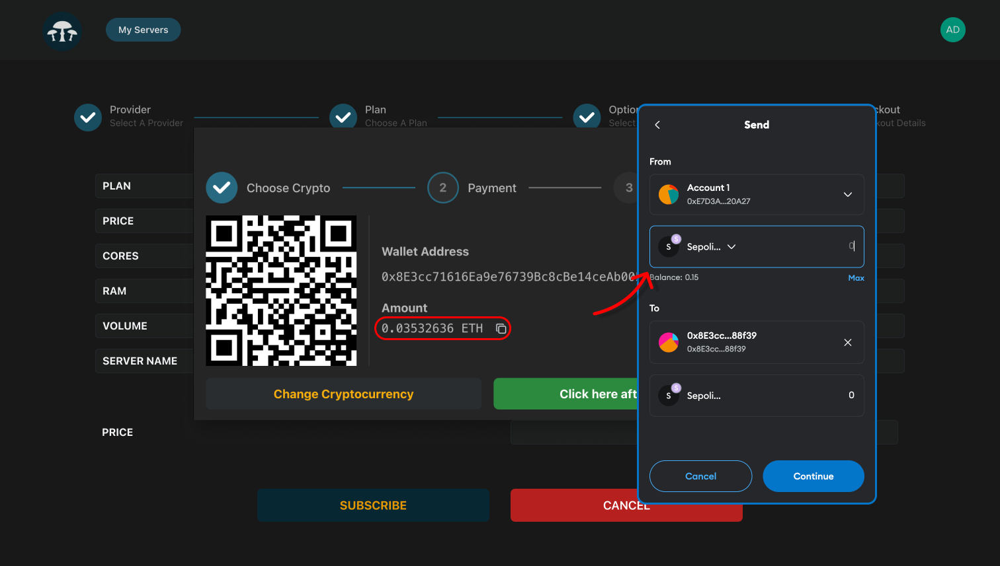

  ### Verification and Final Steps

  #### Step 11
  After initiating the transaction, confirm the payment in your crypto wallet. Review the transaction details and finalize the payment by clicking "Confirm" in your wallet interface.

  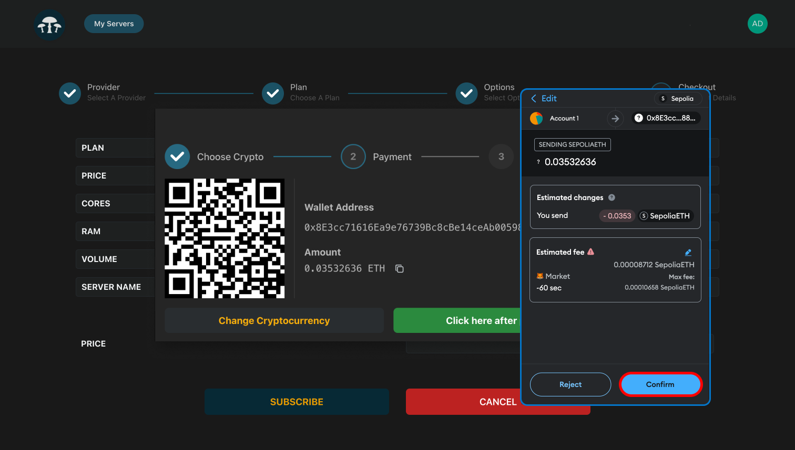

  #### Step 12
  Once the payment is sent, return to the Stereum payment screen and click "Click here after payment" to confirm and finalize the payment process.

  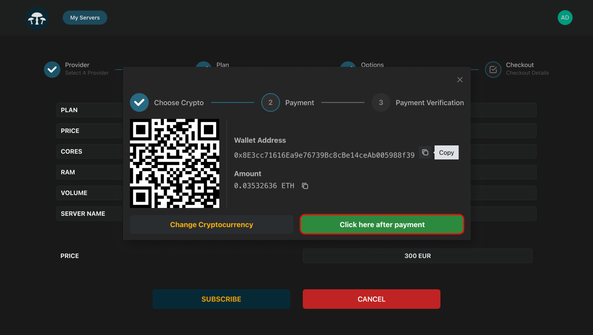

  #### Step 13
  Congrats! This indicates the payment was processed successfully, and your server is being set up. Click on "My Servers" to proceed.

  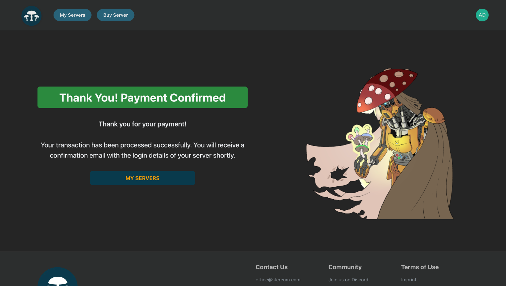

  #### Step 14
  In the My Servers section, you can view your active servers. Verify that your new Ethereum node server is listed and ready to be used.

  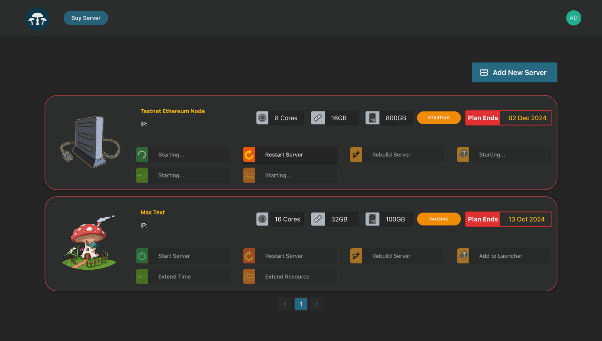

  </TabItem>
</Tabs>

## Local Server Setup

### Create a Bootable USB Stick {#create-bootable-usb}

<Tabs
  defaultValue="windows"
  values={[
    {label: 'Windows', value: 'windows'},
    {label: 'macOS', value: 'mac'},
    {label: 'Linux', value: 'linux'},
  ]}>

  <TabItem value="windows">

  1. Visit the Ubuntu Server download page: [Ubuntu Server](https://ubuntu.com/download/server). Click on the version labeled 'Ubuntu Server 22.04 LTS' to download it.
  
  
  
  2. Download Rufus to create a bootable USB drive from this page: [Rufus](https://rufus.ie/).
  
  
  
  3. Open Rufus once it has downloaded.
  
  
  
  4. Insert your USB stick (minimum 4 GB) into the computer. Rufus should detect your USB stick automatically. If it doesn't appear, select it manually from the 'Device' dropdown menu in Rufus.
  
  
  
  5. In Rufus, next to 'Boot selection', click on the 'SELECT' button. Navigate to where you saved your Ubuntu Server download (the ISO file) and select it.
  
  
  
  6. Leave all other settings in Rufus at their default values. Press 'START' to begin creating your bootable USB.
  
  
  
  7. A warning may pop up about Rufus changing the ISO image mode. Confirm that you want to continue in 'ISO Image mode' by clicking 'OK'.
  
  
  
  8. The creation of the bootable USB will begin. This process may take around 10 minutes, depending on your computer's capabilities.
  
  
  
  9. Once Rufus confirms that the process is complete, you can close Rufus and remove your USB stick.
  
  
  
  10. Your Ubuntu Server bootable USB stick is now ready. Move on to the server setup by following the guide in Part 2 below.
  
  

  </TabItem>

  <TabItem value="mac">

  1. Go to the Ubuntu Server download page: [Ubuntu Server](https://ubuntu.com/download/server) and download the version labeled 'Ubuntu Server 22.04 LTS'.
  2. Insert the USB stick into your Mac. Check that it has at least 2 GB of space available.
  3. Open the 'Disk Utility' application found in the 'Utilities' folder within your 'Applications' folder.
  4. In 'Disk Utility', select your USB stick from the devices listed on the left, then click on the 'Erase' button at the top of the window.
  5. Name your USB stick something memorable, select 'Mac OS Extended (Journaled)' as the format, and then click 'Erase' to start the process.
  6. Once the erasure is complete, close 'Disk Utility'.
  7. Open the 'Terminal' application, also found in the 'Utilities' folder.
  8. Convert your downloaded ISO file to an IMG format by typing the following command in Terminal: `hdiutil convert -format UDRW -o /path/to/your_new.img /path/to/downloaded.iso`. Replace '/path/to/your_new.img' and '/path/to/downloaded.iso' with the actual paths to where you want the new IMG file saved and where your downloaded ISO file is located.
  9. Find the device identifier for your USB stick by typing `diskutil list` in Terminal.
  10. Unmount your USB device with: `diskutil unmountDisk /dev/diskN`. Replace 'diskN' with the identifier from step 9.
  11. Write the IMG file to your USB stick with the following command: `sudo dd if=/path/to/your_new.img of=/dev/rdiskN bs=1m`. Again, replace '/path/to/your_new.img' and '/dev/rdiskN' with the appropriate paths and identifiers.
  12. When the process is complete, you can remove your USB stick.
  13. Your bootable USB stick with Ubuntu Server is ready. Proceed to the next setup phase in Part 2 below.

  </TabItem>

  <TabItem value="linux">
    ToDo: Detailed instructions for creating a bootable USB stick on Linux will be added here.
  </TabItem>

</Tabs>

### Booting from USB and Installing Ubuntu {#booting-and-installing}

1. With the machine off, insert your bootable USB.
2. Turn on the machine and immediately press the F11/F12 or Delete key to open the boot menu.
3. Choose your USB as the primary boot option and save your changes.
4. At the Ubuntu boot screen, select 'Try to install Ubuntu Server'.
5. Follow the on-screen instructions to set your language, keyboard layout, and network settings.
6. Accept all defaults for proxy and mirror settings.
7. Verify that the displayed storage matches your server's specs before continuing with the installation.
8. Complete the forms for server name, username, and password. Skip Ubuntu Pro upgrade and additional snaps installation.
9. After installation, select 'Reboot Now'. Once rebooted, use `hostname -i` to note your server's IP address.

