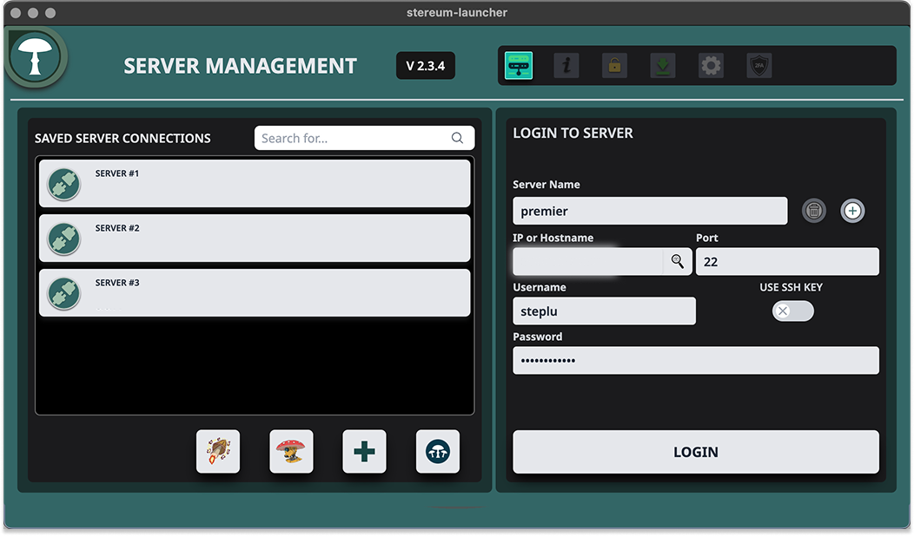
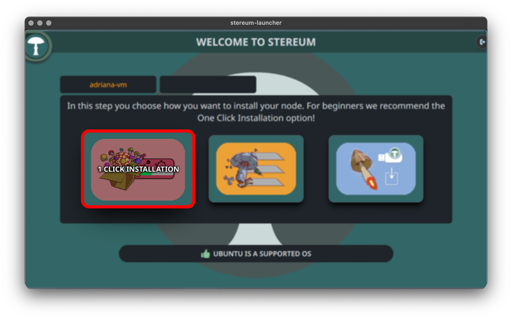

# RPC / Data API Endpoin

## Part 1 / 1 | RPC & Data API Setup

### Step 1
To begin, launch the Stereum application and access the Server Management screen. Enter your server name, IP address, SSH port, username, and password, then click LOGIN to connect securely to your node.

### Step 2
When prompted to change your password, enter a new secure password and click SUBMIT to continue.

### Step 3
On the welcome screen, select 1 Click Installation for a fast and beginner-friendly setup process.

### Step 4
Choose your preferred use case such as Archive or Staking, then select a network from the dropdown.

### Step 5
Select which Execution and Consensus clients you want to use. It's recommended to diversify your clients to help the network’s resilience—try switching from default clients for better decentralization.

### Step 6
Here just click next, as both clients are receiving the full blockchain data set with the Genesis Sync option.

### Step 7
Finally, you’ll confirm the installation paths for each component you’re setting up on your server. This summary screen lists all the chosen services with their respective categories and installation paths, ensuring you have a clear overview of where each service will reside on the server. It’s important to verify that each path is correct to prevent any future operational issues.

### Step 8
Allow Stereum to finish configuring your setup, including services, syncing, and system checks. Wait until the process completes automatically.

### Step 9
Go to the Control tab and click on the RPC box to view your node's endpoints. Make sure both RPC and Data API endpoints are marked as OPEN and copy them for use.

### Step 10
Use these endpoints in your applications or scripts to interact with the node. For example, call the Data API or use the RPC endpoint with a method like getInfo.

